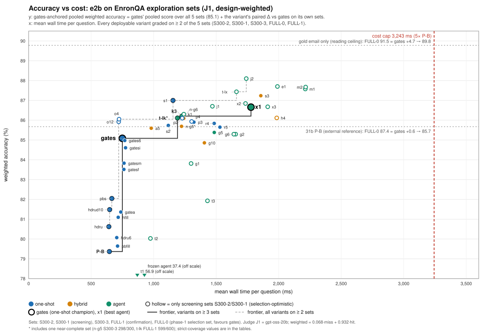
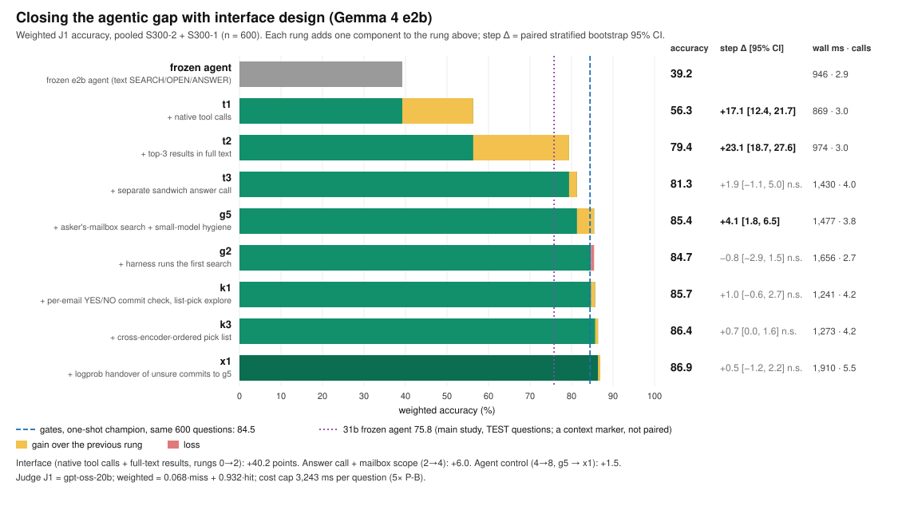

# Worker v: final tables and figures for the paper (round 4)

Prefix `v`. Offline only: stored answers, J1 verdicts and pool records, with no GPU and no TEST data.
- Tool: `benchmarks/premise2/explore2/tools/v-final.js`. It regenerates everything below in about 20 s.
- Coverage helper: `tools/v-inventory.js`.

Outputs (all in `benchmarks/results/premise2/explore/`):

| file | contents |
|---|---|
| `final-tables.json` | everything: per-set rows, pooled rows (all sets / excl. FULL-0 / S300-2+S300-1 / S300-3+FULL-1) with stratified and cluster CIs, cost, Pareto points and frontiers, ladder, paired vs 31b, coverage gaps |
| `final-tables.csv` | one row per variant × set (`row=set`), plus pooled rows (`row=pooled_all`, `pooled_noF0`, `pooled_S2+S1`, `pooled_S3+F1`) |
| `final-pareto.svg` | accuracy vs mean wall ms, every deployable variant on ≥ 2 sets, frontiers, cost cap, references |
| `final-ladder.svg` | agentic-gap ladder, frozen agent → x1, step gains with CIs |

Regenerate: `node benchmarks/premise2/explore2/tools/v-final.js --md <tables.md>`.

Cross-check: `cli2.js report <set> gates x1` was run on S300-3, FULL-1 and S300-1. Every shared row matches v-final exactly: weighted, miss, hit and the Δ vs gates CI. Rows checked: gates, x1, k3, g5, p3, g10, a5, n-g6, s3, t-lk and n-g5 (provisional, 298 q) on S300-3; x1, p3, g5, k3 on FULL-1; x1, j2, m2, t-lx, t-lk, k3, g5, n-g5, p3 on S300-1. The ladder reproduces t.md's point estimates exactly. Its CIs differ by ≤ 0.6 because t used 4,000 reps with a different RNG.

## Methods (for the paper)

**Sets.** Five disjoint sets were drawn from the frozen exploration pool: 30 tuning mailboxes, no TEST questions or emails, and no question or email shared between sets.
- **S300-2 and S300-1** (300 questions each; 100 miss, 200 hit) are the screening sets. Every phase-2 variant was designed and selected on them.
- **S300-3** (300) and **FULL-1** (600; 150 miss, 450 hit) are confirmation sets, run by the lead only and never used for selection.
- **FULL-0** (600) is the phase-1 set on which `gates` was chosen, so it favours `gates`.

**Grading.** Grading is J1: gpt-oss-20b via OpenRouter gives a reference-based CORRECT/INCORRECT verdict. Technical failures (e.g. context overflow) and exact abstentions are graded incorrect without a judge call. Verdicts are joined exactly as in `explore/analyze.js`.

**Weighting.** Each question is in the *miss* stratum (gold email not in P-B's BM25 global top 5) or the *hit* stratum.
- Weighted accuracy = 0.068 · miss + 0.932 · hit, where 0.068 is the pool's true miss share (6.80%). It estimates accuracy on a natural sample.
- A variant counts on a set only if every set question is answered and graded.

**Uncertainty.**
- **Per-set Δ vs gates:** `analyze.js` `pairedBootstrap`, a paired mailbox-cluster bootstrap with 2,000 reps and seed 20260922. This is the same CI that `cli2.js report` prints.
- **Pooled numbers:** computed over the union of each variant's questions. Their Δ uses a paired stratified bootstrap (resampling within miss and hit; 2,000 reps; same seed).
- **Cluster CIs:** the mailbox-cluster CI of every pool is also in the JSON. On the 1,500–2,100-question pools it is nearly identical. On 600-question screening pools it is about 0.5 wider at each end; for example x1 on S300-2+S300-1 is [0.3, 4.7] stratified vs [−0.1, 5.1] cluster.

**Anchored score (Pareto only).** Variants were run on different sets, which differ in difficulty: gates scores 83.7–86.8. The Pareto plot therefore uses a *gates-anchored* score: gates' pooled score over all five sets (85.1, n = 2,100) plus the variant's paired pooled Δ vs gates on its own sets. The raw pooled scores are also in the tables.

**Cost.** Wall ms is the measured end-to-end time per question on the single Windows eval box (Ollama 0.34.2, `gemma4:e2b-it-qat`). It includes BM25, the CPU cross-encoder and every model call. "Calls" counts model calls per question. The cap is a mean of 3,243 ms per question (5× P-B).

**References.**
- **31b P-B** is the same P-B pipeline with Gemma 4 31b, run on FULL-0 only (stored as `pb@1` alias `large`). It is an external reference: its 36 s/question is a different model and machine budget.
- **31b frozen agent (75.8)** comes from the main study on TEST: different questions, so it is not paired.

### Main table: weighted J1 per set (Δ vs gates on the same questions)

| category | variant | S300-2 | S300-1 | S300-3 | FULL-0 | FULL-1 | wall ms | calls |
|---|---|---|---|---|---|---|---|---|
| one-shot | P-B | 81.4 (−3.6) | 77.6 (−6.2) |  | 80.3 (−6.5) |  | 646 | 1.0 |
| one-shot | pbs |  | 81.4 (−2.4) |  | 83.5 (−3.3) |  | 665 | 1.0 |
| one-shot | gates | 85.1 | 83.9 | 83.7 | 86.8 | 84.6 | 749 | 1.0 |
| one-shot | p3 | 85.7 (+0.7) | 84.8 (+1.0) | 84.1 (+0.4) |  | 85.7 (+1.0) | 1,322 | 1.0 |
| hybrid | n-g5 | 86.5 (+1.4) | 85.5 (+1.6) | gap | 86.6 (−0.3) |  | 1,220 | 1.4 |
| hybrid | g10 |  |  | 85.0 (+1.3) | 85.9 (−1.0) |  | 1,406 | 2.6 |
| hybrid | a5 | 85.5 (+0.4) |  | 84.3 (+0.6) |  |  | 981 | 2.1 |
| hybrid | h4 | 85.6 (+0.5) | 85.4 (+1.6) |  |  |  | 1,984 | 5.9 |
| hybrid | n-g6 | 86.5 (+1.5) |  | 84.2 (+0.5) |  |  | 1,241 | 1.5 |
| hybrid | s3 | 87.3 (+2.3) |  | 85.7 (+2.0) |  |  | 1,857 | 2.1 |
| agent | frozen agent | 41.6 (−43.4) | 36.8 (−47.0) |  | 36.9 (−50.0) |  | 926 | 2.9 |
| agent | t1 | 57.7 (−27.3) | 54.9 (−29.0) |  |  |  | 869 | 3.0 |
| agent | t2 | 79.1 (−6.0) | 79.7 (−4.2) |  |  |  | 974 | 3.0 |
| agent | t3 | 80.0 (−5.0) | 82.6 (−1.3) |  |  |  | 1,430 | 4.0 |
| agent | g5 | 84.9 (−0.2) | 86.0 (+2.1) | 87.1 (+3.4) | 84.7 (−2.2) | 85.3 (+0.6) | 1,485 | 3.9 |
| agent | k3 | 86.1 (+1.1) | 86.6 (+2.7) | 86.9 (+3.2) | 87.4 (+0.5) | 84.6 (−0.1) | 1,226 | 4.0 |
| agent | t-lk | 86.1 (+1.0) | 86.1 (+2.2) | 85.3 (+1.6) |  | gap | 1,189 | 3.5 |
| agent | t-lx | 86.1 (+1.0) | 87.5 (+3.7) |  |  |  | 1,662 | 4.8 |
| agent | x1 | 86.1 (+1.1) | 87.7 (+3.8) | 86.0 (+2.3) | 87.4 (+0.6) | 86.0 (+1.3) | 1,778 | 5.3 |
| agent | j2 | 86.9 (+1.9) | 88.0 (+4.1) |  |  |  | 1,741 | 5.4 |
| agent | m2 | 86.1 (+1.0) | 88.0 (+4.2) |  |  |  | 2,216 | 6.8 |
| diagnostic | oracles (gold email only, sandwich prompt) |  |  |  | 91.5 (+4.7) |  | 334 | 1.0 |
| diagnostic | oracle (gold email only, T2 prompt) |  |  |  | 88.6 (+1.8) |  | 308 | 1.0 |
| reference | 31b P-B |  |  |  | 87.4 (+0.6) |  | 36,250 | 1.0 |

Notes:
- "gap" means the variant has answers on that set but incomplete coverage (see Data quality).
- Hybrids beyond n-g5 and g10 are every hybrid graded on ≥ 2 sets: a5, h4, n-g6, s3.
- The oracles row is gold email only with the sandwich prompt, i.e. e2b's reading ceiling under perfect retrieval.
- 31b P-B is the same P-B pipeline run by Gemma 4 31b; on FULL-0 it is 87.4, as in BRIEF.

### Pooled (Δ vs gates on the same questions, paired stratified bootstrap 95% CI)

| category | variant | sets | n | pooled W (miss / hit) | Δ vs gates [CI] | gates same q | excl. FULL-0: n | W | Δ vs gates [CI] | S300-3+FULL-1: W | Δ vs gates [CI] |
|---|---|---|---|---|---|---|---|---|---|---|---|
| one-shot | P-B | S2+S1+F0 | 1200 | 80.0 (3.7 / 85.5) | −5.7 [−7.9, −3.6] | 85.7 | 600 | 79.5 | −4.9 [−8.3, −1.8] | – | – |
| one-shot | pbs | S1+F0 | 900 | 82.9 (4.0 / 88.6) | −3.0 [−4.0, −2.2] | 85.9 | 300 | 81.4 | −2.4 [−3.7, −1.6] | – | – |
| one-shot | gates | S2+S1+S3+F0+F1 | 2100 | 85.1 (30.5 / 89.1) | – | 85.1 | 1500 | 84.4 | – | 84.3 | – |
| one-shot | p3 | S2+S1+S3+F1 | 1500 | 85.2 (40.2 / 88.5) | +0.8 [0.3, 1.3] | 84.4 | same |  |  | 85.1 | +0.8 [0.1, 1.6] |
| hybrid | n-g5 | S2+S1+F0 | 1200 | 86.3 (41.7 / 89.5) | +0.6 [−0.5, 1.7] | 85.7 | 600 | 86.0 | +1.5 [0.0, 3.0] | – | – |
| hybrid | g10 | S3+F0 | 900 | 85.5 (36.8 / 89.1) | −0.2 [−1.5, 1.1] | 85.7 | 300 | 85.0 | +1.3 [−0.3, 3.0] | – | – |
| hybrid | a5 | S2+S3 | 600 | 84.9 (32.0 / 88.8) | +0.5 [0.2, 0.8] | 84.4 | same |  |  | – | – |
| hybrid | h4 | S2+S1 | 600 | 85.5 (54.5 / 87.8) | +1.0 [−0.6, 2.7] | 84.5 | same |  |  | – | – |
| hybrid | n-g6 | S2+S3 | 600 | 85.4 (32.5 / 89.3) | +1.0 [−0.3, 2.4] | 84.4 | same |  |  | – | – |
| hybrid | s3 | S2+S3 | 600 | 86.5 (39.0 / 90.0) | +2.2 [0.3, 4.3] | 84.4 | same |  |  | – | – |
| agent | frozen agent | S2+S1+F0 | 1200 | 38.0 (11.7 / 39.9) | −47.7 [−51.1, −44.4] | 85.7 | 600 | 39.2 | −45.2 [−50.4, −40.3] | – | – |
| agent | t1 | S2+S1 | 600 | 56.3 (16.0 / 59.3) | −28.1 [−32.9, −23.9] | 84.5 | same |  |  | – | – |
| agent | t2 | S2+S1 | 600 | 79.4 (13.0 / 84.3) | −5.1 [−8.4, −2.0] | 84.5 | same |  |  | – | – |
| agent | t3 | S2+S1 | 600 | 81.3 (13.5 / 86.3) | −3.2 [−5.8, −0.4] | 84.5 | same |  |  | – | – |
| agent | g5 | S2+S1+S3+F0+F1 | 2100 | 85.4 (40.3 / 88.7) | +0.3 [−1.0, 1.6] | 85.1 | 1500 | 85.7 | +1.3 [−0.2, 2.8] | 85.8 | +1.5 [−0.3, 3.6] |
| agent | k3 | S2+S1+S3+F0+F1 | 2100 | 86.2 (43.3 / 89.3) | +1.1 [0.3, 2.0] | 85.1 | 1500 | 85.7 | +1.3 [0.3, 2.4] | 85.3 | +1.0 [−0.4, 2.4] |
| agent | t-lk | S2+S1+S3 | 900 | 85.8 (42.0 / 89.0) | +1.6 [0.5, 2.8] | 84.2 | same |  |  | – | – |
| agent | t-lx | S2+S1 | 600 | 86.8 (46.5 / 89.8) | +2.4 [0.2, 4.5] | 84.5 | same |  |  | – | – |
| agent | x1 | S2+S1+S3+F0+F1 | 2100 | 86.7 (44.5 / 89.7) | +1.6 [0.5, 2.6] | 85.1 | 1500 | 86.3 | +2.0 [0.7, 3.2] | 85.9 | +1.7 [0.2, 3.3] |
| agent | j2 | S2+S1 | 600 | 87.5 (46.0 / 90.5) | +3.0 [0.9, 5.1] | 84.5 | same |  |  | – | – |
| agent | m2 | S2+S1 | 600 | 87.0 (50.0 / 89.8) | +2.6 [0.5, 4.8] | 84.5 | same |  |  | – | – |
| diagnostic | oracles | F0 | 600 | 91.5 (82.0 / 92.2) | +4.7 [2.3, 7.1] | 86.8 | – | – | – | – | – |
| diagnostic | oracle | F0 | 600 | 88.6 (85.3 / 88.9) | +1.8 [−1.1, 4.8] | 86.8 | – | – | – | – | – |
| reference | 31b P-B | F0 | 600 | 87.4 (3.3 / 93.6) | +0.6 [−2.2, 3.3] | 86.8 | – | – | – | – | – |

How to read the pooled table:
- "gates same q" is gates' pooled score on exactly the variant's questions. The Δ column is the comparable number across rows; absolute pooled scores depend on which sets a variant has.
- "excl. FULL-0" equals the main pool for variants that never ran on FULL-0 ("same").
- The S300-3+FULL-1 pool is the cleanest: confirmation sets only, never used for selection.

### Cost per question (pooled over each variant's graded sets; cap 3,243 ms mean)

| category | variant | n | wall mean | p50 | p95 | max | calls mean | calls max | mean ≤ cap |
|---|---|---|---|---|---|---|---|---|---|
| one-shot | P-B | 1200 | 646 | 618 | 965 | 1,782 | 1.00 | 1 | yes |
| one-shot | pbs | 900 | 665 | 639 | 987 | 1,589 | 1.00 | 1 | yes |
| one-shot | gates | 2100 | 749 | 714 | 1,103 | 3,030 | 1.02 | 2 | yes |
| one-shot | p3 | 1500 | 1,322 | 1,333 | 1,973 | 4,029 | 1.02 | 2 | yes |
| hybrid | n-g5 | 1200 | 1,220 | 943 | 2,413 | 4,147 | 1.36 | 3 | yes |
| hybrid | g10 | 900 | 1,406 | 1,037 | 2,708 | 4,548 | 2.65 | 6 | yes |
| hybrid | a5 | 600 | 981 | 942 | 1,398 | 3,273 | 2.08 | 4 | yes |
| hybrid | h4 | 600 | 1,984 | 1,599 | 3,779 | 5,797 | 5.92 | 20 | yes |
| hybrid | n-g6 | 600 | 1,241 | 1,067 | 2,329 | 3,550 | 1.49 | 3 | yes |
| hybrid | s3 | 600 | 1,857 | 1,472 | 4,062 | 4,996 | 2.06 | 4 | yes |
| agent | frozen agent | 1200 | 926 | 912 | 1,390 | 2,377 | 2.85 | 5 | yes |
| agent | t1 | 600 | 869 | 844 | 1,205 | 1,661 | 3.03 | 5 | yes |
| agent | t2 | 600 | 974 | 945 | 1,390 | 1,705 | 3.03 | 5 | yes |
| agent | t3 | 600 | 1,430 | 1,392 | 2,044 | 2,766 | 4.03 | 6 | yes |
| agent | g5 | 2100 | 1,485 | 1,436 | 2,067 | 3,785 | 3.86 | 5 | yes |
| agent | k3 | 2100 | 1,226 | 896 | 3,069 | 5,220 | 4.00 | 14 | yes |
| agent | t-lk | 900 | 1,189 | 961 | 2,351 | 4,093 | 3.49 | 9 | yes |
| agent | t-lx | 600 | 1,662 | 1,809 | 2,895 | 4,543 | 4.76 | 10 | yes |
| agent | x1 | 2100 | 1,778 | 1,775 | 3,352 | 5,361 | 5.28 | 14 | yes |
| agent | j2 | 600 | 1,741 | 1,307 | 3,401 | 5,109 | 5.36 | 14 | yes |
| agent | m2 | 600 | 2,216 | 2,269 | 4,185 | 6,487 | 6.80 | 15 | yes |
| diagnostic | oracles | 600 | 334 | 314 | 544 | 1,118 | 1.00 | 1 | yes |
| diagnostic | oracle | 600 | 308 | 288 | 490 | 1,110 | 1.00 | 1 | yes |
| reference | 31b P-B | 600 | 36,250 | 35,144 | 47,160 | 74,489 | 1.00 | 1 | no (different model) |

The cap applies to the mean, and every variant here is under it. The tails of the agents pass 3.2 s:
- p95: x1 3,352 ms, j2 3,401 ms, m2 4,185 ms.
- max: 5.4–6.5 s.
- calls: x1 averages 5.3 calls per question (max 14); the minimal agent t-lk averages 3.5 (max 9).

## Pareto frontier

`benchmarks/results/premise2/explore/final-pareto.svg` shows every deployable variant graded on ≥ 2 sets. Diagnostics, replays and the x1 replicate are excluded.
- Points marked * include one near-complete set (t-lk FULL-1 599/600, n-g5 S300-3 298/300; see Data quality). The figure uses these values because they use all available data. The strict-coverage values are in the tables below.
- Colour shows the category. Hollow markers are variants seen only on the screening sets S300-2/S300-1, which are selection-optimistic. gates and x1 are drawn large.
- The red dashed line is the cost cap.
- The dotted lines are the gold-only reading ceiling and the 31b P-B reference, both anchored through their FULL-0 Δ vs gates.
- The frozen agent and t1 are off scale (37.4 and 56.9).

### Pareto frontier (gates-anchored pooled W = gates' 5-set pooled 85.1 + paired Δ vs gates on the variant's own sets)

| variant | category | sets | anchored W | Δ vs gates [CI] | raw pooled W | wall mean ms | calls |
|---|---|---|---|---|---|---|---|
| hdru | one-shot | S1+F0 | 80.6 | −4.5 [−6.7, −2.2] | 81.4 | 642 | 1.0 |
| hdrud10 | one-shot | S1+F0 | 81.5 | −3.6 [−5.8, −1.4] | 82.3 | 648 | 1.0 |
| pbs | one-shot | S1+F0 | 82.0 | −3.0 [−4.0, −2.2] | 82.9 | 665 | 1.0 |
| o12 | one-shot | S2+S1 | 85.9 | +0.8 [−1.5, 3.2] | 85.3 | 720 | 1.0 |
| o4 | one-shot | S2+S1 | 86.0 | +1.0 [−1.2, 3.2] | 85.4 | 723 | 1.0 |
| s1 | one-shot | S2+S3 | 87.0 | +1.9 [0.0, 4.1] | 86.3 | 1,155 | 1.0 |
| t-lx | agent | S2+S1 | 87.4 | +2.4 [0.2, 4.5] | 86.8 | 1,662 | 4.8 |
| j2 | agent | S2+S1 | 88.1 | +3.0 [0.9, 5.1] | 87.5 | 1,741 | 5.4 |

Robust frontier (only variants graded on ≥ 3 sets):

| variant | category | sets | anchored W | Δ vs gates [CI] | raw pooled W | wall mean ms | calls |
|---|---|---|---|---|---|---|---|
| P-B | one-shot | S2+S1+F0 | 79.4 | −5.7 [−7.9, −3.6] | 80.0 | 646 | 1.0 |
| gates | one-shot | S2+S1+S3+F0+F1 | 85.1 | – | 85.1 | 749 | 1.0 |
| t-lk | agent | S2+S1+S3 | 86.7 | +1.6 [0.5, 2.8] | 85.8 | 1,189 | 3.5 |

Sensitivity, with the provisional rows (≥ 99% coverage) folded in: n-g5 → S2+S1+S3+F0, n 1498, Δ vs gates +0.6 [−0.3, 1.6], anchored 85.7, 1,223 ms; t-lk → S2+S1+S3+F1, n 1499, Δ vs gates +1.0 [0.1, 2.0], anchored 86.1, 1,191 ms. Robust frontier then: P-B (79.4, 646 ms) → gates (85.1, 749 ms) → t-lk (86.1, 1,191 ms) → k3 (86.2, 1,226 ms) → x1 (86.7, 1,778 ms).

Frontier on raw pooled W instead: hdru (81.4, 642 ms) → hdrud10 (82.3, 648 ms) → pbs (82.9, 665 ms) → o12 (85.3, 720 ms) → o4 (85.4, 723 ms) → gates6 (85.8, 769 ms) → s1 (86.3, 1155 ms) → t-lx (86.8, 1662 ms) → j2 (87.5, 1741 ms)

**Which frontier to quote.** Quote the robust frontier with the near-complete rows folded in: **P-B (79.4, 646 ms) → gates (85.1, 749) → t-lk (86.1, 1,191) → k3 (86.2, 1,226) → x1 (86.7, 1,778)**. This is the solid line in the figure.
- Under strict coverage t-lk is pooled over S300-2+S300-1+S300-3 only. That pool leaves out its weaker FULL-1 run (+0.2 vs gates), and two of its three sets are screening sets. So strict coverage puts t-lk (+1.6) above x1 (+1.57), and the frontier ends P-B → gates → t-lk. On shared questions, t-lk trails x1 by 0.9 [−2.1, 0.2] (head-to-head table below), so the strict ordering is a coverage artefact.
- The all-variants frontier is dominated by variants seen only on two 300-question sets. That makes it partly a winner's-curse artefact:
- o4 and o12 are hit-prompt variants whose gains were shown in round 1 to flip at random.
- s1 is built on r5, which lost 0.8 on FULL-0.
- j2 and t-lx were never run on a confirmation set.

### All deployable variants with ≥ 2 graded sets (sorted by anchored W)

| variant | category | sets | n | anchored W | Δ vs gates [CI] | cluster CI | raw pooled W | wall mean ms | calls | frontier (all / ≥3 sets) |
|---|---|---|---|---|---|---|---|---|---|---|
| j2 | agent | S2+S1 | 600 | 88.1 | +3.0 [0.9, 5.1] | [0.6, 5.5] | 87.5 | 1,741 | 5.4 | all |
| e1 | agent | S2+S1 | 600 | 87.7 | +2.6 [0.8, 4.5] | [0.6, 4.6] | 87.1 | 1,990 | 5.9 |  |
| m2 | agent | S2+S1 | 600 | 87.7 | +2.6 [0.5, 4.8] | [0.0, 5.3] | 87.0 | 2,216 | 6.8 |  |
| m1 | agent | S2+S1 | 600 | 87.6 | +2.5 [0.4, 4.6] | [0.0, 5.2] | 86.9 | 2,213 | 6.8 |  |
| t-lx | agent | S2+S1 | 600 | 87.4 | +2.4 [0.2, 4.5] | [−0.2, 5.0] | 86.8 | 1,662 | 4.8 | all |
| s3 | hybrid | S2+S3 | 600 | 87.2 | +2.2 [0.3, 4.3] | [0.1, 4.1] | 86.5 | 1,857 | 2.1 |  |
| s1 | one-shot | S2+S3 | 600 | 87.0 | +1.9 [0.0, 4.1] | [−0.2, 3.9] | 86.3 | 1,155 | 1.0 | all |
| x2 | agent | S2+S1 | 600 | 86.8 | +1.8 [0.0, 3.6] | [−0.3, 3.8] | 86.2 | 1,735 | 4.1 |  |
| j1 | agent | S2+S1 | 600 | 86.7 | +1.6 [−0.6, 3.9] | [−0.2, 3.5] | 86.1 | 1,470 | 4.6 |  |
| t-lk | agent | S2+S1+S3 | 900 | 86.7 | +1.6 [0.5, 2.8] | [0.1, 3.0] | 85.8 | 1,189 | 3.5 | ≥3 |
| x3 | agent | S2+S1 | 600 | 86.7 | +1.6 [−0.2, 3.5] | [−0.6, 3.7] | 86.1 | 1,912 | 5.3 |  |
| x1 | agent | S2+S1+S3+F0+F1 | 2100 | 86.7 | +1.6 [0.5, 2.6] | [0.6, 2.5] | 86.7 | 1,778 | 5.3 |  |
| k1 | agent | S2+S1 | 600 | 86.3 | +1.2 [−0.3, 2.9] | [−0.4, 2.8] | 85.7 | 1,241 | 4.2 |  |
| k3 | agent | S2+S1+S3+F0+F1 | 2100 | 86.2 | +1.1 [0.3, 2.0] | [0.3, 1.9] | 86.2 | 1,226 | 4.0 |  |
| h4 | hybrid | S2+S1 | 600 | 86.1 | +1.0 [−0.6, 2.7] | [−0.3, 2.5] | 85.5 | 1,984 | 5.9 |  |
| p2 | one-shot | S2+S1 | 600 | 86.1 | +1.0 [0.6, 1.7] | [0.5, 1.6] | 85.5 | 1,228 | 1.0 |  |
| n-g6 | hybrid | S2+S3 | 600 | 86.1 | +1.0 [−0.3, 2.4] | [−0.3, 2.3] | 85.4 | 1,241 | 1.5 |  |
| o4 | one-shot | S2+S1 | 600 | 86.0 | +1.0 [−1.2, 3.2] | [−1.2, 3.1] | 85.4 | 723 | 1.0 | all |
| p4 | one-shot | S2+S1 | 600 | 85.9 | +0.9 [0.5, 1.2] | [0.4, 1.3] | 85.3 | 1,304 | 1.0 |  |
| o12 | one-shot | S2+S1 | 600 | 85.9 | +0.8 [−1.5, 3.2] | [−1.4, 2.9] | 85.3 | 720 | 1.0 | all |
| p3 | one-shot | S2+S1+S3+F1 | 1500 | 85.9 | +0.8 [0.3, 1.3] | [0.4, 1.3] | 85.2 | 1,322 | 1.0 |  |
| r4 | one-shot | S2+S1+S3+F0 | 1500 | 85.8 | +0.8 [0.2, 1.3] | [0.2, 1.2] | 86.0 | 1,484 | 1.0 |  |
| s2 | one-shot | S2+S3 | 600 | 85.7 | +0.7 [−1.5, 2.8] | [−1.7, 3.3] | 85.0 | 1,117 | 1.0 |  |
| n-g5 | hybrid | S2+S1+F0 | 1200 | 85.7 | +0.6 [−0.5, 1.7] | [−0.3, 1.5] | 86.3 | 1,220 | 1.4 |  |
| r5 | one-shot | S2+S1+S3+F0 | 1500 | 85.6 | +0.6 [−0.7, 1.9] | [−0.6, 1.7] | 85.8 | 1,530 | 1.0 |  |
| a5 | hybrid | S2+S3 | 600 | 85.6 | +0.5 [0.2, 0.8] | [0.3, 0.7] | 84.9 | 981 | 2.1 |  |
| g5 | agent | S2+S1+S3+F0+F1 | 2100 | 85.4 | +0.3 [−1.0, 1.6] | [−0.6, 1.1] | 85.4 | 1,485 | 3.9 |  |
| g2 | agent | S2+S1 | 600 | 85.3 | +0.2 [−0.4, 0.6] | [−0.4, 0.7] | 84.7 | 1,656 | 2.7 |  |
| g6 | agent | S2+S1 | 600 | 85.3 | +0.2 [−0.4, 0.6] | [−0.4, 0.7] | 84.7 | 1,641 | 2.7 |  |
| gates | one-shot | S2+S1+S3+F0+F1 | 2100 | 85.1 | – | – | 85.1 | 749 | 1.0 | ≥3 |
| gates6 | one-shot | S1+F0 | 900 | 85.0 | −0.1 [−0.3, 0.1] | [−0.3, 0.1] | 85.8 | 769 | 1.0 |  |
| g10 | hybrid | S3+F0 | 900 | 84.9 | −0.2 [−1.5, 1.1] | [−1.4, 1.0] | 85.5 | 1,406 | 2.6 |  |
| gatesi | one-shot | S1+F0 | 900 | 84.6 | −0.5 [−2.1, 1.1] | [−1.7, 0.8] | 85.4 | 775 | 1.0 |  |
| gatesm | one-shot | S1+F0 | 900 | 83.8 | −1.3 [−2.7, 0.2] | [−2.7, 0.1] | 84.6 | 763 | 1.0 |  |
| g1 | agent | S2+S1 | 600 | 83.8 | −1.3 [−3.6, 1.0] | [−3.8, 1.4] | 83.2 | 1,299 | 3.7 |  |
| gatesf | one-shot | S1+F0 | 900 | 83.5 | −1.6 [−3.3, 0.0] | [−2.9, −0.2] | 84.3 | 762 | 1.0 |  |
| pbs | one-shot | S1+F0 | 900 | 82.0 | −3.0 [−4.0, −2.2] | [−4.1, −2.0] | 82.9 | 665 | 1.0 | all |
| t3 | agent | S2+S1 | 600 | 81.9 | −3.2 [−5.8, −0.4] | [−6.2, −0.2] | 81.3 | 1,430 | 4.0 |  |
| hdrud10 | one-shot | S1+F0 | 900 | 81.5 | −3.6 [−5.8, −1.4] | [−6.2, −1.2] | 82.3 | 648 | 1.0 | all |
| gatea | one-shot | S1+F0 | 900 | 81.4 | −3.7 [−6.0, −1.4] | [−6.6, −1.2] | 82.2 | 737 | 1.0 |  |
| hfill | one-shot | S1+F0 | 900 | 81.1 | −4.0 [−6.4, −1.7] | [−6.0, −2.0] | 81.9 | 716 | 1.0 |  |
| hdru | one-shot | S1+F0 | 900 | 80.6 | −4.5 [−6.7, −2.2] | [−6.5, −2.3] | 81.4 | 642 | 1.0 | all |
| hdru6 | one-shot | S1+F0 | 900 | 80.1 | −5.0 [−7.4, −2.6] | [−7.4, −2.8] | 80.9 | 705 | 1.0 |  |
| t2 | agent | S2+S1 | 600 | 80.0 | −5.1 [−8.4, −2.0] | [−9.3, −1.0] | 79.4 | 974 | 3.0 |  |
| pbfill | one-shot | S1+F0 | 900 | 79.6 | −5.4 [−7.8, −3.1] | [−8.1, −2.8] | 80.5 | 711 | 1.0 |  |
| P-B | one-shot | S2+S1+F0 | 1200 | 79.4 | −5.7 [−7.9, −3.6] | [−8.4, −3.2] | 80.0 | 646 | 1.0 | ≥3 |
| t1 | agent | S2+S1 | 600 | 56.9 | −28.1 [−32.9, −23.9] | [−34.6, −22.0] | 56.3 | 869 | 3.0 |  |
| frozen agent | agent | S2+S1+F0 | 1200 | 37.4 | −47.7 [−51.1, −44.4] | [−51.6, −44.1] | 38.0 | 926 | 2.9 |  |

### Head-to-head on shared questions (paired stratified bootstrap; "+prov" = provisional ≥ 99% rows included)

| A | B | shared sets | n | Δ (A − B) [CI] | Δ miss | Δ hit |
|---|---|---|---|---|---|---|
| t-lk | x1 | S2+S1+S3 | 900 | −0.8 [−2.2, 0.6] | −2.7 | −0.7 |
| t-lk | x1 | S2+S1+S3+F1 (+prov) | 1499 | −0.9 [−2.1, 0.2] | −3.3 | −0.8 |
| t-lk | k3 | S2+S1+S3 | 900 | −0.7 [−1.4, −0.2] | −1.7 | −0.7 |
| t-lk | k3 | S2+S1+S3+F1 (+prov) | 1499 | −0.3 [−1.1, 0.5] | −2.0 | −0.2 |
| k3 | x1 | S2+S1+S3+F0+F1 | 2100 | −0.5 [−1.4, 0.4] | −1.2 | −0.4 |
| g5 | x1 | S2+S1+S3+F0+F1 | 2100 | −1.3 [−2.3, −0.2] | −4.2 | −1.1 |
| p3 | x1 | S2+S1+S3+F1 | 1500 | −1.1 [−2.4, 0.1] | −3.8 | −1.0 |
| t-lx | x1 | S2+S1 | 600 | −0.1 [−0.2, 0.0] | −1.5 | +0.0 |
| j2 | x1 | S2+S1 | 600 | +0.6 [−0.1, 1.5] | −2.0 | +0.8 |
| m2 | x1 | S2+S1 | 600 | +0.1 [0.0, 0.3] | +2.0 | +0.0 |
| n-g5 | gates | S2+S1+F0 | 1200 | +0.6 [−0.5, 1.7] | +7.1 | +0.1 |
| n-g5 | gates | S2+S1+S3+F0 (+prov) | 1498 | +0.6 [−0.3, 1.6] | +7.6 | +0.1 |
| p3 | gates | S2+S1+S3+F1 | 1500 | +0.8 [0.3, 1.3] | +12.0 | +0.0 |

## Agentic-gap ladder

`benchmarks/results/premise2/explore/final-ladder.svg` shows the rungs, each adding one component to the rung above (rung definitions in t.md §1), pooled over S300-2 + S300-1.

### Agentic-gap ladder (pooled S300-2 + S300-1, n = 600; step Δ vs the previous rung, paired stratified bootstrap)

| # | rung | component added | S300-2 | S300-1 | pooled W (miss / hit) | step Δ [CI] | Δ vs frozen | wall ms | calls |
|---|---|---|---|---|---|---|---|---|---|
| 0 | frozen agent | frozen e2b agent (text SEARCH/OPEN/ANSWER) | 41.6 | 36.8 | 39.2 (11.5 / 41.3) | – | – | 946 | 2.87 |
| 1 | t1 | + native tool calls | 57.7 | 54.9 | 56.3 (16.0 / 59.3) | +17.1 [12.4, 21.7] | +17.1 | 869 | 3.03 |
| 2 | t2 | + top-3 results in full text | 79.1 | 79.7 | 79.4 (13.0 / 84.3) | +23.1 [18.7, 27.6] | +40.2 | 974 | 3.03 |
| 3 | t3 | + separate sandwich answer call | 80.0 | 82.6 | 81.3 (13.5 / 86.3) | +1.9 [−1.1, 5.0] | +42.1 | 1,430 | 4.03 |
| 4 | g5 | + asker's-mailbox search + small-model hygiene | 84.9 | 86.0 | 85.4 (43.5 / 88.5) | +4.1 [1.8, 6.5] | +46.2 | 1,477 | 3.83 |
| 5 | g2 | + harness runs the first search | 85.0 | 84.3 | 84.7 (39.0 / 88.0) | −0.8 [−2.9, 1.5] | +45.4 | 1,656 | 2.66 |
| 6 | k1 | + per-email YES/NO commit check, list-pick explore | 86.1 | 85.3 | 85.7 (47.0 / 88.5) | +1.0 [−0.6, 2.7] | +46.5 | 1,241 | 4.25 |
| 7 | k3 | + cross-encoder-ordered pick list | 86.1 | 86.6 | 86.4 (47.0 / 89.3) | +0.7 [0.0, 1.6] | +47.1 | 1,273 | 4.22 |
| 8 | x1 | + logprob handover of unsure commits to g5 | 86.1 | 87.7 | 86.9 (48.0 / 89.8) | +0.5 [−1.2, 2.2] | +47.7 | 1,910 | 5.50 |
| ref | gates | no agent (one-shot champion) | 85.1 | 83.9 | 84.5 (32.5 / 88.3) | | | 759 | 1.03 |
| ref | t-lx | vs x1: −0.1 [−0.2, 0.0] | 86.1 | 87.5 | 86.8 (46.5 / 89.8) | | | 1,662 | 4.76 |
| ref | t-lk | vs x1: −0.8 [−2.5, 1.0] | 86.1 | 86.1 | 86.1 (46.0 / 89.0) | | | 1,191 | 3.50 |
| ref | j2 | vs x1: +0.6 [−0.1, 1.5] | 86.9 | 88.0 | 87.5 (46.0 / 90.5) | | | 1,741 | 5.36 |
| ref | m2 | vs x1: +0.1 [0.0, 0.3] | 86.1 | 88.0 | 87.0 (50.0 / 89.8) | | | 2,216 | 6.80 |

The gap decomposes as in t.md:
- **Interface: +40.2.** Native tool calls give +17.1, and showing the top results in full gives +23.1. Both CIs are far from 0.
- **Answer call and mailbox scope: +6.0.** The separate sandwich answer call gives +1.9 (n.s.); mailbox search and hygiene give +4.1 [1.8, 6.5].
- **Agent control, g5 → x1: +1.5.** None of the four control steps is individually significant.

### Paired vs 31b P-B on FULL-0 (the only set with the 31b run; mailbox-cluster bootstrap)

| variant | FULL-0 W | miss | hit | Δ vs 31b P-B [CI] | Δ miss | Δ hit |
|---|---|---|---|---|---|---|
| P-B | 80.3 | 2.7 | 86.0 | −7.1 [−10.5, −3.7] | −0.7 | −7.6 |
| pbs | 83.5 | 3.3 | 89.3 | −3.9 [−6.7, −1.3] | +0.0 | −4.2 |
| gates | 86.8 | 37.3 | 90.4 | −0.6 [−3.7, 2.4] | +34.0 | −3.1 |
| r4 | 87.2 | 46.0 | 90.2 | −0.2 [−3.2, 2.6] | +42.7 | −3.3 |
| r5 | 86.1 | 47.3 | 88.9 | −1.4 [−4.9, 2.1] | +44.0 | −4.7 |
| n-g5 | 86.6 | 42.7 | 89.8 | −0.8 [−4.0, 2.3] | +39.3 | −3.8 |
| g10 | 85.9 | 41.3 | 89.1 | −1.6 [−5.2, 1.8] | +38.0 | −4.4 |
| frozen agent | 36.9 | 12.0 | 38.7 | −50.6 [−55.0, −45.5] | +8.7 | −54.9 |
| g5 | 84.7 | 42.0 | 87.8 | −2.8 [−6.7, 0.9] | +38.7 | −5.8 |
| k3 | 87.4 | 45.3 | 90.4 | +0.0 [−3.5, 3.3] | +42.0 | −3.1 |
| x1 | 87.4 | 46.0 | 90.4 | +0.0 [−3.4, 3.4] | +42.7 | −3.1 |
| oracles | 91.5 | 82.0 | 92.2 | +4.1 [1.0, 7.3] | +78.7 | −1.3 |

On the one set where the 31b reference exists:
- x1 and k3 tie 31b P-B exactly (87.4 each).
- They get there differently: e2b agents are far better on hard-retrieval questions (misses +42–43) and worse at reading (hits −3.1).
- Gold-only e2b reading (oracles) still trails 31b on hits (92.2 vs 93.6).

## Key findings for slides

1. **A 2B model can be a good agent.** The best e2b agent (x1) scores **86.7** over 2,100 exploration questions, **+1.6 [0.5, 2.6]** over the best one-shot pipeline (gates, 85.1). On the two never-used confirmation sets alone (900 q) it is +1.7 [0.2, 3.3].
2. **The agentic gap closes.** On the same 600 questions, the frozen plain-text e2b agent scores **39.2** and x1 **86.9**, a gain of 47.7 points.
3. **It is the interface, not the model.** Native tool calls give **+17.1** [12.4, 21.7]. Showing the top search results in full text gives **+23.1** [18.7, 27.6]. Searching the asker's own mailbox gives **+4.1** [1.8, 6.5]. The agent-control refinements after that are each within noise (−0.8 to +1.0).
4. **e2b agent = 31b one-shot on FULL-0.** x1 scores 87.4 and 31b P-B 87.4 (Δ 0.0 [−3.4, 3.4]). x1 wins hard-retrieval questions (+43 points on misses) and loses on reading (−3.1 on hits). The main study's 31b frozen agent scored 75.8 on TEST (different questions).
5. **Gains come from hard retrieval.** x1 vs gates is misses 44.5 vs 30.5, but hits only 89.7 vs 89.1, and hits carry 93% of the weight.
6. **Reading is near its ceiling.** Given only the gold email, e2b scores 91.5 (hits 92.2) on FULL-0. Every system from gates on reads hits at 88.5–90.5 pooled, so at most about 2 points are left on hits. Misses still trail gold-only by about 36 points (FULL-0: x1 46.0 vs 82.0), but they weigh only 6.8%.
7. **All within budget, and a cheap agent keeps most of the gain.** The cap is a mean of 3,243 ms per question.
   - gates: 749 ms, 1 call.
   - x1: 1,778 ms, 5.3 calls (p95 3.35 s).
   - The minimal agent t-lk (YES/NO check of the top results, then one list pick): 1,191 ms, 3.5 calls. It is +1.0 [0.1, 2.0] over gates and −0.9 [−2.1, 0.2] vs x1 on 1,499 shared questions.
8. **Accuracy vs cost frontier** (systems tested on ≥ 3 sets): P-B 79.4 @ 646 ms → gates 85.1 @ 749 → t-lk 86.1 @ 1,191 → k3 86.2 @ 1,226 → x1 86.7 @ 1,778. The cheap one-shot step (P-B → gates, +5.7 for +100 ms) buys the most; agents add +1.0 to +1.6 for 1.6–2.4× the time.
9. **One-shot and hybrid refinements are small.**
   - p3 (triggered email swap) gives +0.8 [0.3, 1.3] over gates and is positive on all 4 of its sets.
   - Confidence-gated hybrids do not reliably beat gates: n-g5 +0.6 [−0.5, 1.7], g10 −0.2 [−1.5, 1.1].
10. **Late refinements are noise-level, and screening gains shrink.** j2 is +0.6 [−0.1, 1.5] vs x1, m2 +0.1, t-lx −0.1. Screening gains shrink on fresh sets: x1 +2.5 on screening → +1.7 on confirmation; n-g5 +1.5 → −0.3 on FULL-0.

## Data quality

### Coverage gaps (phase-2 sets; not used)

- g1@1+cold on S300-2: 30/300 answered, 30 graded
- g2@1+cold on S300-2: 30/300 answered, 30 graded
- n-g5@1+cold on S300-3: 298/300 answered, 298 graded
- t-lk@1+cold on FULL-1: 599/600 answered, 599 graded
- m3@1+cold on S300-1: 300/300 answered, 297 graded

Provisional rows (≥ 99% answered, all graded; Δ vs gates on the answered questions, cluster bootstrap; not pooled):

| variant | set | answered | W | miss | hit | Δ vs gates [CI] | wall mean | calls |
|---|---|---|---|---|---|---|---|---|
| n-g5 | S300-3 | 298/300 | 84.4 | 27.6 | 88.5 | +0.6 [−0.8, 2.1] | 1,235 | 1.37 |
| t-lk | FULL-1 | 599/600 | 84.8 | 38.3 | 88.2 | +0.2 [−1.1, 1.7] | 1,193 | 3.29 |

Duplicates: none
Single-set variants (not pooled/plotted): a1, a2, a3, a4, cascg, estar, g7, g8, g9, gate, h6, k2, k4, m3, n-cr1, n-cs2, o1, o11, o2, o3, o5, o6, o7, o9, oracle, oracles, p1, pb:large, pbu, quote, r1, r2, rrfu, s4, s5, sel10u, sel5, w2, w4, w6, w7

- **Coverage gaps (excluded):**
  - **n-g5 on S300-3:** 298/300 answered (2 questions never got a final answer). n-g5 is pooled over S300-2, S300-1 and FULL-0 only. Its provisional S300-3 row (84.4, +0.6 [−0.8, 2.1] on 298 questions) matches `cli2 report`.
  - **m3 on S300-1:** 297/300 graded (3 answers ungraded), so m3 is a single-set variant here.
  - **t-lk on FULL-1:** 599/600 answered. One question (`dev:dasovich-j/deleted_items/1872.#1`) ended in `http_error`; resuming `run FULL-1 t-lk` would fill it. The 599 graded answers appear as a provisional row (84.8, +0.2 [−1.1, 1.7] vs gates) and are folded into the sensitivity frontier and the figure, but not into the strict pooled tables.
  - **t-lk on S300-3:** run and graded by the lead during this round (300/300 graded at 16:58 ET), so it is included.
  - **g1@1 / g2@1 on S300-2:** 30-question smoke runs, superseded by g1@2 / g2@2 (full).
- **Version mixing (same code, different run mode).** "+cold" means the model was reloaded before the variant; the code version is the same.
  - pb uses `pb@1` (phase-1 run) on S300-1 and FULL-0 and `pb@1+cold` on S300-2.
  - The frozen agent uses `agent@1` on FULL-0 and `agent@1+cold` on S300-2 and S300-1.
  - hdru6, hdrud10 and hfill likewise.
- **No duplicates.** There is one latest final answer per question for each variant@version. No set has two fully graded versions of a variant.
- **Technical failures are graded incorrect.** Mostly these are context overflows:
  - gates 5/2,100, x1 5/2,100, k3 4/2,100, p3 6/1,500, g5 2/2,100.
  - Output-limit truncations: ≤ 4 per variant.
- **Excluded from cost and Pareto.**
  - Replays: their wall time covers only the replayed step. These are z-think1, z-ext1 and e1o.
  - Diagnostics: n-lp0, and oracle/oracles (in the tables as ceilings only).
  - t-x1r: byte-identical to x1.
  - Round-4 y*/h* variants are ignored. h4, h6 and hdru* from earlier rounds are kept.
- **Selection caveats.**
  - x1, its logprob threshold (τ = −0.1) and every round-3/4 variant were tuned on S300-2/S300-1.
  - The journal marks S300-1 as part of p3's trigger training data. p.md says the trigger was fitted on dev only; the lead should settle which is right.
  - FULL-0 favours gates (its hit score there is 90.4 vs 87.5–89.0 elsewhere). The "excl. FULL-0" and "S300-3+FULL-1" columns are the fairer comparisons.

## Appendix: per-set detail

### Per-set detail (Δ vs gates: paired mailbox-cluster bootstrap, as cli2 report)

| variant | set | n | W | miss | hit | Δ vs gates [CI] | wall mean | calls |
|---|---|---|---|---|---|---|---|---|
| P-B | S300-2 | 300 | 81.4 | 5.0 | 87.0 | −3.6 [−10.2, 2.5] | 653 | 1.00 |
| P-B | S300-1 | 300 | 77.6 | 4.0 | 83.0 | −6.2 [−12.6, −0.3] | 634 | 1.00 |
| P-B | FULL-0 | 600 | 80.3 | 2.7 | 86.0 | −6.5 [−8.9, −4.2] | 649 | 1.00 |
| pbs | S300-1 | 300 | 81.4 | 5.0 | 87.0 | −2.4 [−3.7, −1.5] | 662 | 1.00 |
| pbs | FULL-0 | 600 | 83.5 | 3.3 | 89.3 | −3.3 [−4.8, −2.0] | 667 | 1.00 |
| gates | S300-2 | 300 | 85.1 | 31.0 | 89.0 | – | 763 | 1.04 |
| gates | S300-1 | 300 | 83.9 | 34.0 | 87.5 | – | 756 | 1.02 |
| gates | S300-3 | 300 | 83.7 | 18.0 | 88.5 | – | 745 | 1.03 |
| gates | FULL-0 | 600 | 86.8 | 37.3 | 90.4 | – | 752 | 1.01 |
| gates | FULL-1 | 600 | 84.6 | 29.3 | 88.7 | – | 739 | 1.03 |
| p3 | S300-2 | 300 | 85.7 | 41.0 | 89.0 | +0.7 [0.4, 1.0] | 1,301 | 1.03 |
| p3 | S300-1 | 300 | 84.8 | 48.0 | 87.5 | +1.0 [0.3, 1.7] | 1,317 | 1.01 |
| p3 | S300-3 | 300 | 84.1 | 30.0 | 88.0 | +0.4 [−1.0, 1.3] | 1,341 | 1.01 |
| p3 | FULL-1 | 600 | 85.7 | 41.3 | 88.9 | +1.0 [0.3, 1.7] | 1,326 | 1.02 |
| n-g5 | S300-2 | 300 | 86.5 | 38.0 | 90.0 | +1.4 [−0.4, 3.2] | 1,241 | 1.39 |
| n-g5 | S300-1 | 300 | 85.5 | 44.0 | 88.5 | +1.6 [−0.3, 3.9] | 1,258 | 1.40 |
| n-g5 | FULL-0 | 600 | 86.6 | 42.7 | 89.8 | −0.3 [−2.0, 1.3] | 1,190 | 1.33 |
| g10 | S300-3 | 300 | 85.0 | 30.0 | 89.0 | +1.3 [−0.3, 2.9] | 1,414 | 2.71 |
| g10 | FULL-0 | 600 | 85.9 | 41.3 | 89.1 | −1.0 [−2.7, 0.8] | 1,402 | 2.62 |
| a5 | S300-2 | 300 | 85.5 | 37.0 | 89.0 | +0.4 [0.2, 0.6] | 987 | 2.08 |
| a5 | S300-3 | 300 | 84.3 | 27.0 | 88.5 | +0.6 [0.2, 1.0] | 974 | 2.08 |
| h4 | S300-2 | 300 | 85.6 | 52.0 | 88.0 | +0.5 [−0.7, 1.5] | 2,017 | 5.96 |
| h4 | S300-1 | 300 | 85.4 | 57.0 | 87.5 | +1.6 [−1.1, 4.4] | 1,952 | 5.87 |
| n-g6 | S300-2 | 300 | 86.5 | 39.0 | 90.0 | +1.5 [−0.4, 3.3] | 1,254 | 1.53 |
| n-g6 | S300-3 | 300 | 84.2 | 26.0 | 88.5 | +0.5 [−1.0, 2.0] | 1,228 | 1.46 |
| s3 | S300-2 | 300 | 87.3 | 44.0 | 90.5 | +2.3 [0.0, 4.6] | 2,334 | 2.06 |
| s3 | S300-3 | 300 | 85.7 | 34.0 | 89.5 | +2.0 [−1.2, 5.2] | 1,380 | 2.05 |
| frozen agent | S300-2 | 300 | 41.6 | 9.0 | 44.0 | −43.4 [−51.0, −36.0] | 960 | 2.88 |
| frozen agent | S300-1 | 300 | 36.8 | 14.0 | 38.5 | −47.0 [−53.6, −40.8] | 932 | 2.86 |
| frozen agent | FULL-0 | 600 | 36.9 | 12.0 | 38.7 | −50.0 [−54.7, −44.7] | 906 | 2.83 |
| t1 | S300-2 | 300 | 57.7 | 13.0 | 61.0 | −27.3 [−34.3, −20.0] | 879 | 3.02 |
| t1 | S300-1 | 300 | 54.9 | 19.0 | 57.5 | −29.0 [−36.4, −21.6] | 859 | 3.04 |
| t2 | S300-2 | 300 | 79.1 | 12.0 | 84.0 | −6.0 [−11.5, −0.6] | 975 | 3.04 |
| t2 | S300-1 | 300 | 79.7 | 14.0 | 84.5 | −4.2 [−9.4, 0.9] | 973 | 3.02 |
| t3 | S300-2 | 300 | 80.0 | 12.0 | 85.0 | −5.0 [−9.0, −0.9] | 1,432 | 4.04 |
| t3 | S300-1 | 300 | 82.6 | 15.0 | 87.5 | −1.3 [−4.7, 2.3] | 1,429 | 4.02 |
| g5 | S300-2 | 300 | 84.9 | 42.0 | 88.0 | −0.2 [−3.5, 3.2] | 1,484 | 3.82 |
| g5 | S300-1 | 300 | 86.0 | 45.0 | 89.0 | +2.1 [−0.4, 4.9] | 1,471 | 3.85 |
| g5 | S300-3 | 300 | 87.1 | 34.0 | 91.0 | +3.4 [−0.2, 7.1] | 1,505 | 3.90 |
| g5 | FULL-0 | 600 | 84.7 | 42.0 | 87.8 | −2.2 [−4.6, 0.2] | 1,498 | 3.84 |
| g5 | FULL-1 | 600 | 85.3 | 38.7 | 88.7 | +0.6 [−2.0, 2.7] | 1,469 | 3.88 |
| k3 | S300-2 | 300 | 86.1 | 47.0 | 89.0 | +1.1 [−0.8, 2.8] | 1,288 | 4.28 |
| k3 | S300-1 | 300 | 86.6 | 47.0 | 89.5 | +2.7 [−0.2, 5.8] | 1,259 | 4.17 |
| k3 | S300-3 | 300 | 86.9 | 37.0 | 90.5 | +3.2 [1.4, 5.2] | 1,241 | 4.13 |
| k3 | FULL-0 | 600 | 87.4 | 45.3 | 90.4 | +0.5 [−0.8, 1.9] | 1,197 | 3.80 |
| k3 | FULL-1 | 600 | 84.6 | 40.7 | 87.8 | −0.1 [−1.6, 1.4] | 1,200 | 3.93 |
| t-lk | S300-2 | 300 | 86.1 | 46.0 | 89.0 | +1.0 [−0.9, 2.8] | 1,204 | 3.52 |
| t-lk | S300-1 | 300 | 86.1 | 46.0 | 89.0 | +2.2 [−0.4, 4.9] | 1,177 | 3.47 |
| t-lk | S300-3 | 300 | 85.3 | 34.0 | 89.0 | +1.6 [−0.3, 3.6] | 1,185 | 3.49 |
| t-lx | S300-2 | 300 | 86.1 | 46.0 | 89.0 | +1.0 [−2.0, 4.2] | 1,681 | 4.84 |
| t-lx | S300-1 | 300 | 87.5 | 47.0 | 90.5 | +3.7 [0.8, 6.8] | 1,643 | 4.69 |
| x1 | S300-2 | 300 | 86.1 | 47.0 | 89.0 | +1.1 [−1.9, 4.3] | 1,820 | 5.59 |
| x1 | S300-1 | 300 | 87.7 | 49.0 | 90.5 | +3.8 [0.9, 6.9] | 1,999 | 5.41 |
| x1 | S300-3 | 300 | 86.0 | 38.0 | 89.5 | +2.3 [0.2, 4.3] | 1,702 | 5.25 |
| x1 | FULL-0 | 600 | 87.4 | 46.0 | 90.4 | +0.6 [−1.2, 2.6] | 1,691 | 4.99 |
| x1 | FULL-1 | 600 | 86.0 | 42.7 | 89.1 | +1.3 [−0.4, 2.9] | 1,772 | 5.36 |
| j2 | S300-2 | 300 | 86.9 | 45.0 | 90.0 | +1.9 [−0.7, 4.8] | 1,778 | 5.50 |
| j2 | S300-1 | 300 | 88.0 | 47.0 | 91.0 | +4.1 [1.2, 7.2] | 1,703 | 5.22 |
| m2 | S300-2 | 300 | 86.1 | 46.0 | 89.0 | +1.0 [−2.0, 4.2] | 2,237 | 6.91 |
| m2 | S300-1 | 300 | 88.0 | 54.0 | 90.5 | +4.2 [1.2, 7.3] | 2,194 | 6.70 |
| oracles | FULL-0 | 600 | 91.5 | 82.0 | 92.2 | +4.7 [2.3, 7.2] | 334 | 1.00 |
| oracle | FULL-0 | 600 | 88.6 | 85.3 | 88.9 | +1.8 [−0.6, 4.3] | 308 | 1.00 |
| 31b P-B | FULL-0 | 600 | 87.4 | 3.3 | 93.6 | +0.6 [−2.3, 3.7] | 36,250 | 1.00 |
