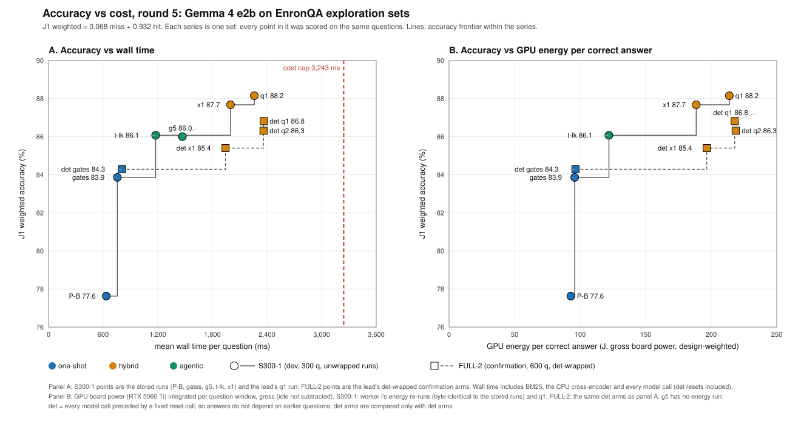

# Worker v5: round-5 tables and figures for the presentation

Prefix `v5`. Everything here is offline: stored exploration answers, J1 verdicts, pool records and the energy summaries. No GPU, no OpenRouter calls and no TEST data were used.
- **Tool:** `benchmarks/premise2/explore2/tools/v5-final.js`. It runs in about 10 s.
- **Regenerate:** `node benchmarks/premise2/explore2/tools/v5-final.js --md <tables.md>`.
- **Outputs** (all in `benchmarks/results/premise2/explore/`):

| file | contents |
|---|---|
| `final-r5-tables.json` | every row below with its full contrasts (Δ, CI, miss/hit Δ, discordant counts, sign-flip p), cost, run windows, the energy rows, gaps |
| `final-r5-tables.csv` | one row per system × set (or pool), and one row per energy measurement (`table=energy`) |
| `final-r5-pareto.svg` | two panels: (A) accuracy vs mean wall ms; (B) accuracy vs GPU J per correct answer |

- **Round-4 numbers** (Tables 2c and 2d) are read from v-final's `final-tables.json` (generated Tue 6 Oct 17:02 ET); they are not recomputed. `v-final.js` and its outputs are unchanged. v-final.js is not imported, because it writes its outputs when loaded. v5 uses the same modules instead: `explore/analyze.js`, `explore/grade.js` and `judge.js`.

## Headline findings (for slides)

Each number below comes from this note's tables or from the round-5 journal, as named. All intervals are 95%.

1. **The retrieval stack q1 replicates on a clean confirmation set.** On FULL-2 (600 questions, used for nothing else), det q1 scores 86.8 against det x1's 85.4: **+1.4 [0.6, 2.2]**. Against det gates it is +2.5 [0.4, 5.1].
   - **Pooled over the three fresh sets** (S300-4 + S300-5 + FULL-2, 1,200 questions): **+1.29 [0.49, 2.47]**, sign-flip p = 0.004. The discordant pairs split misses +30/−9, hits +12/−4.
   - **Per set:** S300-4 +2.4, S300-5 +0.0, FULL-2 +1.4.
   - **Caveat:** q1 was named before the run as the secondary arm, so preferring it over q2 now is a post-hoc choice on FULL-2.
2. **Thread labels (q2) did not replicate.** The primary contrast fixed before the run, q2 − det x1 on FULL-2, is **+0.9 [−1.5, 3.1]**. By the pre-registered rule that is "consistent, not confirmed".
   - The screening gain on S300-4 + S300-5 was +2.5 [0.2, 4.6].
   - The labels' own share on FULL-2, q2 − q1, is −0.5 [−3.0, 1.7]. Over 1,800 earlier questions, x1 + labels was +0.47 [−0.75, 1.7].
3. **The gains come from hard retrieval; hit reading is at e2b's ceiling.** On FULL-2, q1 lifts miss accuracy from 40.7 to 49.3 but hit accuracy only from 88.7 to 89.6, and hits carry 93.2% of the weight. Given only the gold email (FULL-0), e2b reads hits at 92.2; every system from gates on reads them at 88.5–90.5. Every round-5 attempt on reading was null:
   - **b (few-shot demonstrations):** gates + 4 similar demos −0.0 [−2.7, 3.0] over 600 questions.
   - **c (email rendering and labels):** null; see item 2.
   - **u (context-aware decoding):** +1.3 hit points on single-email gold reads (+38/−24 over 1,500 questions), but nothing end to end. u-xyc vs x1 is −0.1 [−2.3, 2.1] on S300-4 and +0.1 [−1.9, 1.8] on S300-5 (Table 1b).
   - **l (self-verification):** e2b's YES/NO verifier is a grounding check, not a correctness check. It ranks a right answer above a wrong one in 76.9% of hit pairs with the gold email as evidence, but word overlap alone gets 73.6%. On pairs where both answers are drawn from the email it is at chance: 52% (gold email), 51% (x1's YES email). The deployable selector l-xs1 is −1.74 [−3.74, 0.16] vs x1 over 600 questions.
4. **x1's edge over gates is small on fresh questions.** Unwrapped, x1 − gates is −1.0 [−3.5, 2.2] on S300-4 and −0.4 [−2.7, 1.5] on S300-5. Det-wrapped on FULL-2 it is +1.1 [−0.8, 3.6]. Over all 7 sets (2,700 questions) it is +1.1 [0.15, 2.0], and the advantage is in the miss stratum.
5. **det makes runs history-independent.** Unwrapped, cross-question prompt-cache state flips about 2 verdicts per 300 questions. On S300-1 it caused 5 flips on paths where x1 and t-lk issue identical prompts. Behind det:
   - those paths are byte-identical: 141/141 commits, 38/38 nofound;
   - identical call sequences reproduce 300/300;
   - every question where no q1 component acts is byte-identical to det x1 (411/411 on the decision sets).

   Cost: +32 ms per question on gates (+4%) and +151 ms (±52) on x1 (+8%). Accuracy is unchanged: det x1 87.3 vs x1 87.7 on S300-1. Because only discordant pairs carry information, det-paired intervals are narrow (q1 on FULL-2: [0.6, 2.2]).
6. **Energy per correct answer by tier** (GPU board power, gross, design-weighted; Table 3):
   - **S300-1:** one-shot P-B 93 J and gates 96 J; agentic t-lk 122 J; hybrid x1 189 J and q1 214 J.
   - **FULL-2 (det):** gates 96, x1 197, q1 218, q2 219.
   - **What the energy buys:** gates gains +6.3 points over P-B for +3% energy per correct answer, and x1 +10.1 points for 2.0×. On FULL-2, q1 gains +1.4 over det x1 for +11%, and +2.5 over det gates for 2.3×.
7. **CI erratum: no decision changed.** 15 analysis tools drew bootstrap indices from an LCG computed in doubles, which falls into a cycle of 10,466 numbers (419 in one tool). About 190 intervals were recomputed; no promotion, null or confirmation decision changes. Four worker-note statements no longer hold at 95%, e.g. l-xs1 [−3.74, 0.16] and k1 − gates [−0.38, 2.8]. `analyze.js` / `cli2 report`, `v-final.js` and `q-stats.js` were never affected, and neither was any interval computed here.

## Sets, grading and statistics

| set | role | n (miss / hit) | used here for |
|---|---|---|---|
| S300-4, S300-5 | round-5 decision sets (each worker ran at most 2 variants there) | 300 (100 / 200) each | Table 1 |
| FULL-2 | round-5 clean confirmation: lead only, rule fixed before the run, used for nothing else | 600 (150 / 450) | Table 1, Table 3, figure |
| S300-1 | development set (screening set in rounds 2–4) | 300 (100 / 200) | Tables 2a, 2b, 3, figure |
| S300-2, S300-3, FULL-0, FULL-1 | round-4 sets | | round-4 numbers via v-final (Tables 2c, 2d) |

- **Grading.** J1: gpt-oss-20b via OpenRouter gives a reference-based CORRECT/INCORRECT verdict. Technical failures and exact abstentions are graded incorrect. Verdicts are joined as in `explore/analyze.js`.
- **Weighting.** Weighted accuracy (W) = 0.068 · miss + 0.932 · hit, where 6.8% is the pool's true share of misses (the gold email is not in P-B's BM25 top 5). The S300 sets are one-third misses and FULL sets one-quarter, so the raw mean would overstate misses.
- **Coverage.** A system counts on a set only if every question is answered and graded. On the fresh sets there are no gaps.
- **Pairing rule.**
  - Det-wrapped arms are compared only with det-wrapped arms: references det x1 (`i-det-x1` v2) and det gates (`i-det-gates` v2).
  - Unwrapped arms are compared only with unwrapped arms: references x1 and gates.
  - Every Δ is the row's system minus the reference, on the same questions.
- **Intervals.**
  - Every Δ uses `explore/analyze.js` `pairedBootstrap`: a paired mailbox-cluster bootstrap with 2,000 reps and seed 20260922, the same CI that `cli2.js report` prints.
  - Pooled rows bootstrap the union of the pairs, with each mailbox as one cluster across sets, as `tools/q-stats.js` does. The sets share the 30 tuning mailboxes.
  - **p** is a two-sided sign-flip randomisation test over the discordant pairs (`tools/rng.js` mulberry32(7), 200,000 draws), identical to `q-stats.js`.
  - None of these use the LCG from the CI erratum.
- **Cost.** Wall ms is the measured end-to-end time per question on the single eval box (Ollama 0.34.2, `gemma4:e2b-it-qat`), including BM25, the CPU cross-encoder and every model call. For det arms, calls include the resets; real calls are in parentheses. The cost cap is a mean of 3,243 ms per question.

## 1. Fresh sets (round 5)

### Table 1. Fresh sets, round 5 (J1 weighted; Δ = paired mailbox-cluster bootstrap 95% CI)

| family | system | rows | n | W | miss | hit | Δ vs x1 ref [CI] | Δ vs gates ref [CI] | discordant vs x1 ref (miss · hit) | p (sign-flip) | wall ms mean | p95 | calls (real) |
|---|---|---|---|---|---|---|---|---|---|---|---|---|---|
| unwrapped | gates | S300-4 | 300 | 87.9 | 32.0 | 92.0 | +1.0 [−2.2, 3.5] | – | +2/−21 · +7/−2 | 0.50 | 783 | 1,305 | 1.0 |
| unwrapped | gates | S300-5 | 300 | 83.2 | 17.0 | 88.0 | +0.4 [−1.5, 2.7] | – | +2/−17 · +7/−4 | 0.86 | 967 | 1,489 | 1.0 |
| unwrapped | gates | pooled S4+S5 | 600 | 85.5 | 24.5 | 90.0 | +0.7 [−2.1, 2.4] | – | +4/−38 · +14/−6 | 0.51 | 875 | 1,442 | 1.0 |
| unwrapped | x1 | S300-4 | 300 | 86.9 | 51.0 | 89.5 | – | −1.0 [−3.5, 2.2] | – | – | 1,906 | 3,487 | 5.7 |
| unwrapped | x1 | S300-5 | 300 | 82.8 | 32.0 | 86.5 | – | −0.4 [−2.7, 1.5] | – | – | 2,391 | 4,168 | 6.0 |
| unwrapped | x1 | pooled S4+S5 | 600 | 84.8 | 41.5 | 88.0 | – | −0.7 [−2.4, 2.1] | – | – | 2,148 | 3,952 | 5.9 |
| det | det gates | FULL-2 | 600 | 84.3 | 27.3 | 88.4 | −1.1 [−3.6, 0.8] | – | +4/−24 · +9/−10 | 0.25 | 807 | 1,254 | 2.0 (1.0) |
| det | det x1 | S300-4 | 300 | 86.9 | 52.0 | 89.5 | – | – | – | – | 1,997 | 3,711 | 11.4 (5.7) |
| det | det x1 | S300-5 | 300 | 82.2 | 30.0 | 86.0 | – | – | – | – | 2,053 | 3,756 | 11.9 (5.9) |
| det | det x1 | FULL-2 | 600 | 85.4 | 40.7 | 88.7 | – | +1.1 [−0.8, 3.6] | – | – | 1,944 | 3,870 | 11.0 (5.5) |
| det | det x1 | S4+S5 | 600 | 84.6 | 41.0 | 87.8 | – | – | – | – | 2,025 | 3,742 | 11.6 (5.8) |
| det | det x1 | pooled S4+S5+F2 | 1200 | 85.0 | 40.9 | 88.2 | – | – | – | – | 1,985 | 3,764 | 11.3 (5.7) |
| det | det q1 | S300-4 | 300 | 89.4 | 60.0 | 91.5 | +2.4 [0.4, 4.5] | – | +9/−1 · +5/−1 | 0.032 | 2,444 | 4,507 | 13.2 (6.6) |
| det | det q1 | S300-5 | 300 | 82.2 | 30.0 | 86.0 | +0.0 [−1.8, 1.9] | – | +4/−4 · +2/−2 | 1.00 | 2,545 | 4,581 | 14.2 (7.1) |
| det | det q1 | FULL-2 | 600 | 86.8 | 49.3 | 89.6 | +1.4 [0.6, 2.2] | +2.5 [0.4, 5.1] | +17/−4 · +5/−1 | 0.007 | 2,363 | 4,453 | 13.0 (6.5) |
| det | det q1 | S4+S5 | 600 | 85.8 | 45.0 | 88.8 | +1.2 [−0.1, 3.0] | – | +13/−5 · +7/−3 | 0.11 | 2,494 | 4,563 | 13.7 (6.9) |
| det | det q1 | pooled S4+S5+F2 | 1200 | 86.3 | 46.9 | 89.2 | +1.3 [0.5, 2.5] | – | +30/−9 · +12/−4 | 0.004 | 2,429 | 4,515 | 13.4 (6.7) |
| det | det q2 | S300-4 | 300 | 88.9 | 60.0 | 91.0 | +1.9 [−0.6, 4.2] | – | +13/−5 · +6/−3 | 0.18 | 2,436 | 4,435 | 13.2 (6.6) |
| det | det q2 | S300-5 | 300 | 85.3 | 34.0 | 89.0 | +3.1 [0.7, 6.5] | – | +7/−3 · +10/−4 | 0.078 | 2,524 | 4,677 | 14.1 (7.1) |
| det | det q2 | FULL-2 | 600 | 86.3 | 48.0 | 89.1 | +0.9 [−1.5, 3.1] | +2.0 [−0.6, 4.9] | +18/−7 · +15/−13 | 0.42 | 2,362 | 4,521 | 13.1 (6.5) |
| det | det q2 | S4+S5 | 600 | 87.1 | 47.0 | 90.0 | +2.5 [0.2, 4.6] | – | +20/−8 · +16/−7 | 0.026 | 2,480 | 4,597 | 13.7 (6.8) |
| det | det q2 | pooled S4+S5+F2 | 1200 | 86.7 | 47.4 | 89.5 | +1.7 [0.2, 3.3] | – | +38/−15 · +31/−20 | 0.038 | 2,421 | 4,540 | 13.4 (6.7) |

How to read Table 1:
- **Rows.** "S4+S5" is the two decision sets pooled. "pooled S4+S5+F2" is all three fresh sets (1,200 questions).
- **Missing Δ vs det gates.** det gates was run on FULL-2 only, so a det row's Δ vs det gates exists only on FULL-2.
- **Discordant column.** It counts pairs where the row is right and the reference wrong (+), and the reverse (−), for misses · hits. Behind det, concordant pairs are byte-identical wherever the two arms issue the same prompts, so only the discordant pairs carry information.
- **det x1 vs unwrapped x1.** det x1 equals unwrapped x1 on S300-4 (86.9). On S300-5 it is 82.2 vs 82.8, a re-roll (i.md).
- **Inflated wall times.** The lead's unwrapped gates and x1 runs on S300-4/5 (Tue 20:44–21:15 ET) ran while round-5 workers had CPU jobs going. For example, gates took 967 ms on S300-5, against 749 ms pooled in round 4. The det arms ran in the day's GPU queue (Wed 08:19–10:52 ET).
- **FULL-2 confirmation rule** (journal, fixed before the run).
  - The primary contrast was q2 − det x1. It is +0.9 [−1.5, 3.1], so q2 is "consistent, not confirmed".
  - q1 − det x1 is a secondary, descriptive contrast: +1.4 [0.6, 2.2], and +1.29 [0.49, 2.47] over 1,200 questions.

### Table 1b. Other variants stored on the decision sets (unwrapped; vs the lead's unwrapped x1 and gates)

| system | what it is | rows | W | miss | hit | Δ vs x1 [CI] | Δ vs gates [CI] | wall ms | calls |
|---|---|---|---|---|---|---|---|---|---|
| d6 | x1 + lexical CE explore list | S300-4 | 86.6 | 53.0 | 89.0 | −0.3 [−1.6, 0.3] | −1.4 [−4.3, 1.9] | 1,926 | 5.7 |
| d6 | x1 + lexical CE explore list | S300-5 | 82.9 | 33.0 | 86.5 | +0.1 [0.1, 0.1] | −0.3 [−2.7, 1.6] | 1,982 | 6.0 |
| d6 | x1 + lexical CE explore list | pooled S4+S5 | 84.7 | 43.0 | 87.8 | −0.1 [−0.8, 0.2] | −0.8 [−2.5, 1.8] | 1,954 | 5.9 |
| d8 | d6 + g5 handover seeded with x1's first-YES email | S300-4 | 87.9 | 53.0 | 90.5 | +1.1 [−0.8, 2.9] | +0.0 [−2.9, 3.2] | 1,921 | 5.7 |
| d8 | d6 + g5 handover seeded with x1's first-YES email | S300-5 | 82.7 | 30.0 | 86.5 | −0.1 [−1.4, 1.2] | −0.5 [−3.6, 2.0] | 1,975 | 6.0 |
| d8 | d6 + g5 handover seeded with x1's first-YES email | pooled S4+S5 | 85.3 | 41.5 | 88.5 | +0.5 [−0.7, 1.6] | −0.2 [−2.2, 2.6] | 1,948 | 5.9 |
| c-fin3 | x1 + thread labels on chain emails | S300-4 | 86.8 | 50.0 | 89.5 | −0.1 [−2.0, 1.7] | −1.1 [−3.5, 1.8] | 1,874 | 5.7 |
| c-fin3 | x1 + thread labels on chain emails | S300-5 | 84.5 | 36.0 | 88.0 | +1.7 [−0.3, 4.0] | +1.3 [−2.0, 4.1] | 1,950 | 6.0 |
| c-fin3 | x1 + thread labels on chain emails | pooled S4+S5 | 85.6 | 43.0 | 88.8 | +0.8 [−0.9, 1.8] | +0.1 [−1.7, 2.3] | 1,912 | 5.9 |
| c-fin4 | gates + thread labels on chain emails | S300-4 | 84.9 | 28.0 | 89.0 | −2.0 [−4.3, 0.2] | −3.1 [−5.7, −0.6] | 762 | 1.0 |
| c-fin4 | gates + thread labels on chain emails | S300-5 | 84.8 | 21.0 | 89.5 | +2.0 [−0.7, 5.4] | +1.7 [−1.7, 5.1] | 762 | 1.0 |
| c-fin4 | gates + thread labels on chain emails | pooled S4+S5 | 84.8 | 24.5 | 89.3 | +0.0 [−2.7, 1.6] | −0.7 [−3.0, 1.6] | 762 | 1.0 |
| u-xyc | x1 + CAD re-read of the YES email on sure commits | S300-4 | 86.8 | 50.0 | 89.5 | −0.1 [−2.3, 2.1] | −1.1 [−3.9, 2.2] | 2,238 | 5.7 |
| u-xyc | x1 + CAD re-read of the YES email on sure commits | S300-5 | 82.9 | 33.0 | 86.5 | +0.1 [−1.9, 1.8] | −0.3 [−3.1, 2.0] | 2,313 | 6.0 |
| u-xyc | x1 + CAD re-read of the YES email on sure commits | pooled S4+S5 | 84.8 | 41.5 | 88.0 | +0.0 [−1.5, 1.4] | −0.7 [−2.5, 2.2] | 2,276 | 5.9 |
| u-gpad | placebo: gates with its prompt padded by periods (not a candidate) | S300-4 | 86.8 | 29.0 | 91.0 | −0.1 [−2.3, 1.8] | −1.1 [−4.1, 2.2] | 1,076 | 1.0 |
| u-gpad | placebo: gates with its prompt padded by periods (not a candidate) | S300-5 | 85.6 | 19.0 | 90.5 | +2.8 [0.8, 4.8] | +2.5 [0.1, 4.9] | 1,106 | 1.0 |
| u-gpad | placebo: gates with its prompt padded by periods (not a candidate) | pooled S4+S5 | 86.2 | 24.0 | 90.8 | +1.4 [−0.6, 2.5] | +0.7 [−1.4, 2.9] | 1,091 | 1.0 |

Notes:
- These are the other variants stored on the decision sets, all unwrapped, compared with the lead's unwrapped runs.
- The **u-gpad placebo** is a content-free prompt change. It moves gates by +2.5 on S300-5 alone. That is the size of a single-set swing this design produces by chance, and why the promotion bar was +1.5 pooled.
- **d6 on S300-5:** the interval [0.1, 0.1] is degenerate because d6 and x1 differ on a single question there.
- **c-fin3:** c's own note reports the same point estimate (+0.8) with a stratified interval (erratum: [−1.4, 3.0]).

## 2. Tiers and the ladder

Tier labels follow the lead's round-5 grouping. "Hybrid" is a harness-driven pipeline that hands unsure questions to the g5 agent. v-final (round 4) filed x1 under "agent"; the numbers do not depend on the label.

### Table 2a. Tiers on one set: S300-1 (development set, 300 q; unwrapped runs)

| tier | system | version | W | miss | hit | Δ vs gates [CI] | Δ vs x1 [CI] | wall ms mean | p95 | calls |
|---|---|---|---|---|---|---|---|---|---|---|
| one-shot | P-B | 1 | 77.6 | 4.0 | 83.0 | −6.2 [−12.6, −0.3] | −10.1 [−14.4, −6.1] | 634 | 955 | 1.0 |
| one-shot | gates | 1+cold | 83.9 | 34.0 | 87.5 | – | −3.8 [−6.9, −0.9] | 756 | 1,073 | 1.0 |
| hybrid | x1 | 1+cold | 87.7 | 49.0 | 90.5 | +3.8 [0.9, 6.9] | – | 1,999 | 3,919 | 5.4 |
| hybrid | q1 | 1+cold | 88.2 | 56.0 | 90.5 | +4.3 [1.2, 7.6] | +0.5 [0.1, 0.9] | 2,261 | 4,212 | 6.7 |
| agentic | g5 | 1+cold | 86.0 | 45.0 | 89.0 | +2.1 [−0.4, 4.9] | −1.7 [−3.8, 0.5] | 1,471 | 2,055 | 3.9 |
| agentic | t-lk | 1+cold | 86.1 | 46.0 | 89.0 | +2.2 [−0.4, 4.9] | −1.6 [−3.9, 0.8] | 1,177 | 2,284 | 3.5 |

S300-1 is the one set where every tier has a stored, fully graded run on the same 300 questions. Caveat: it was a screening set in rounds 2–4 (x1's τ and every round-3/4 variant were tuned on S300-2 and S300-1), so it favours x1 and its descendants. The fresh sets are the unbiased comparison.

### Table 2b. Tiers on S300-1, det-wrapped runs (det vs det)

| tier | system | W | miss | hit | Δ vs det gates [CI] | Δ vs det x1 [CI] | wall ms mean | calls (real) |
|---|---|---|---|---|---|---|---|---|
| one-shot | det gates | 83.9 | 34.0 | 87.5 | – | −3.4 [−6.1, −0.9] | 790 | 2.0 (1.0) |
| hybrid | det x1 | 87.3 | 50.0 | 90.0 | +3.4 [0.9, 6.2] | – | 1,947 | 10.8 (5.4) |
| hybrid | det q1 | 87.7 | 56.0 | 90.0 | +3.8 [1.1, 6.8] | +0.4 [0.0, 0.8] | 2,440 | 13.4 (6.7) |
| hybrid | det q2 | 87.8 | 58.0 | 90.0 | +4.0 [1.3, 6.6] | +0.5 [−1.3, 2.3] | 2,398 | 13.3 (6.7) |
| agentic | det t-lk | 86.1 | 46.0 | 89.0 | +2.2 [0.8, 4.0] | −1.2 [−3.6, 1.0] | 1,283 | 6.9 (3.4) |

### Table 2c. Tiers across sets: round-4 pool (v-final, reused) and round-5 fresh sets

| tier | system | round-4 sets (n) | round-4 W (miss / hit) | round-4 Δ vs gates [CI] | round-4 wall ms | round-5 rows | round-5 W | round-5 Δ vs x1 ref [CI] | round-5 Δ vs gates ref [CI] | round-5 wall ms |
|---|---|---|---|---|---|---|---|---|---|---|
| one-shot | P-B | S2+S1+F0 (1200) | 80.0 (3.7 / 85.5) | −5.7 [−7.9, −3.6] | 646 | not run on the fresh sets | | | | |
| one-shot | gates | S2+S1+S3+F0+F1 (2100) | 85.1 (30.5 / 89.1) | – | 749 | unwrapped S4+S5 (600) | 85.5 | +0.7 [−2.1, 2.4] | – | 875 |
| one-shot | gates (det) | (as above) | | |  | det FULL-2 (600) | 84.3 | −1.1 [−3.6, 0.8] | – | 807 |
| hybrid | x1 | S2+S1+S3+F0+F1 (2100) | 86.7 (44.5 / 89.7) | +1.6 [0.5, 2.6] | 1,778 | unwrapped S4+S5 (600) | 84.8 | – | −0.7 [−2.4, 2.1] | 2,148 |
| hybrid | x1 (det) | (as above) | | |  | det S4+S5+F2 (1200) | 85.0 | – | FULL-2: +1.1 [−0.8, 3.6] | 1,985 |
| hybrid | q1 (det) | not run | | |  | det S4+S5+F2 (1200) | 86.3 | +1.3 [0.5, 2.5] | FULL-2: +2.5 [0.4, 5.1] | 2,429 |
| hybrid | q2 (det) | not run | | |  | det S4+S5+F2 (1200) | 86.7 | +1.7 [0.2, 3.3] | FULL-2: +2.0 [−0.6, 4.9] | 2,421 |
| agentic | g5 | S2+S1+S3+F0+F1 (2100) | 85.4 (40.3 / 88.7) | +0.3 [−1.0, 1.6] | 1,485 | not run on the fresh sets | | | | |
| agentic | t-lk | S2+S1+S3 (900) | 85.8 (42.0 / 89.0) | +1.6 [0.5, 2.8]; with FULL-1 599/600: +1.0 [0.1, 2.0] | 1,189 | not run on the fresh sets | | | | |

Round-4 Δs are v-final's paired stratified bootstrap over the variant's own sets; round-5 Δs are the cluster bootstrap of Table 1. t-lk's strict round-4 pool excludes FULL-1 (599/600 answered). The figure with that set folded in is v-final's sensitivity row.

### Table 2d. Agentic-gap ladder (v-final rungs 0-8, pooled S300-2 + S300-1, n = 600) and q1 as rung 9

| # | rung | component added | pooled W (miss / hit) | step Δ [CI] | wall ms | calls |
|---|---|---|---|---|---|---|
| 0 | frozen agent | frozen e2b agent (text SEARCH/OPEN/ANSWER) | 39.2 (11.5 / 41.3) | – | 946 | 2.87 |
| 1 | t1 | + native tool calls | 56.3 (16.0 / 59.3) | +17.1 [12.4, 21.7] | 869 | 3.03 |
| 2 | t2 | + top-3 results in full text | 79.4 (13.0 / 84.3) | +23.1 [18.7, 27.6] | 974 | 3.03 |
| 3 | t3 | + separate sandwich answer call | 81.3 (13.5 / 86.3) | +1.9 [−1.1, 5.0] | 1,430 | 4.03 |
| 4 | g5 | + asker's-mailbox search + small-model hygiene | 85.4 (43.5 / 88.5) | +4.1 [1.8, 6.5] | 1,477 | 3.83 |
| 5 | g2 | + harness runs the first search | 84.7 (39.0 / 88.0) | −0.8 [−2.9, 1.5] | 1,656 | 2.66 |
| 6 | k1 | + per-email YES/NO commit check, list-pick explore | 85.7 (47.0 / 88.5) | +1.0 [−0.6, 2.7] | 1,241 | 4.25 |
| 7 | k3 | + cross-encoder-ordered pick list | 86.4 (47.0 / 89.3) | +0.7 [0.0, 1.6] | 1,273 | 4.22 |
| 8 | x1 | + logprob handover of unsure commits to g5 | 86.9 (48.0 / 89.8) | +0.5 [−1.2, 2.2] | 1,910 | 5.50 |
| 9 | q1, det; S300-1 only (300) | + m2 recovery, d8 seeded handover, d6 explore list (step = det q1 − det x1) | 87.7 (56.0 / 90.0) | +0.4 [0.0, 0.8] | 2,440 | 13.43 (6.71 real) |
| 9 | q1, det; S300-4 + S300-5 + FULL-2 (1,200) | same | 86.3 (46.9 / 89.2) | +1.29 [0.49, 2.47] | 2,429 | 13.37 (6.68 real) |

- **Rungs 0–8** are v-final's ladder (t.md definitions), each adding one component to the rung above.
- **q1 was never run on S300-2,** so it is shown as rung 9 with its step measured det vs det x1:
  - on S300-1, the dev set where m2's rule was chosen;
  - on the three fresh sets.
- **The gap decomposes as before:**
  - interface: +40.2;
  - answer call and mailbox scope: +6.0;
  - agent control g5 → x1: +1.5;
  - the round-5 retrieval mechanisms (q1): about +1.3 on fresh questions.

## 3. Energy

### Table 3. Energy per question and per correct answer (GPU board power; design-weighted per-question means)

| set | system | wrap | n | J1 W | wall ms (design-weighted) | mean GPU W | **GPU J/q (gross)** ± 95% | GPU J/q (marginal) | **GPU J per correct** | × gates (same set, same wrap) | CPU J/q attributed (approx.) | total J per correct (approx.) | idle GPU W |
|---|---|---|---|---|---|---|---|---|---|---|---|---|---|
| S300-1 | P-B | unwrapped | 300 | 77.6 | 647 | 111 | **72** ±3 | 67 | **93** | 0.97× | 5 | 93 | 8.2 (3 windows) |
| S300-1 | gates | unwrapped | 300 | 83.9 | 759 | 106 | **80** ±4 | 74 | **96** | 1.00× | 7 | 96 | 8.2 (3 windows) |
| S300-1 | t-lk | unwrapped | 300 | 86.1 | 1,099 | 96 | **105** ±6 | 96 | **122** | 1.27× | 18 | 132 | 8.2 (3 windows) |
| S300-1 | x1 | unwrapped | 300 | 87.7 | 1,687 | 98 | **165** ±12 | 152 | **189** | 1.97× | 23 | 199 | 8.2 (3 windows) |
| S300-1 | det gates | det | 300 | 83.9 | 789 | 101 | **79** ±4 | 73 | **95** | 1.00× | 8 | 97 | 8.2 (3 windows) |
| S300-1 | det t-lk | det | 300 | 86.1 | 1,180 | 92 | **109** ±7 | 99 | **127** | 1.34× | 19 | 137 | 8.2 (3 windows) |
| S300-1 | det x1 | det | 300 | 87.3 | 1,813 | 96 | **173** ±12 | 159 | **199** | 2.10× | 30 | 217 | 8.2 (3 windows) |
| S300-1 | q1 | unwrapped | 300 | 88.2 | 2,136 | 88 | **189** ±13 | 174 | **214** | 2.23× | 7 (runner not attributed) | 206* | 6.6 (8 windows) |
| FULL-2 | det gates | det | 600 | 84.3 | 774 | 105 | **81** ±3 | 76 | **96** | 1.00× | n/a | n/a | 6.8 (3 windows) |
| FULL-2 | det x1 | det | 600 | 85.4 | 1,743 | 96 | **168** ±8 | 156 | **197** | 2.04× | n/a | n/a | 6.8 (3 windows) |
| FULL-2 | det q1 | det | 600 | 86.8 | 2,164 | 87 | **189** ±9 | 175 | **218** | 2.26× | n/a | n/a | 6.8 (3 windows) |
| FULL-2 | det q2 | det | 600 | 86.3 | 2,169 | 87 | **189** ±9 | 174 | **219** | 2.27× | n/a | n/a | 6.8 (3 windows) |

Method (`tools/i-energy.js`, i.md §3):
- **Power sources.** GPU = RTX 5060 Ti board power from `nvidia-smi` every 100 ms. CPU package power comes from LibreHardwareMonitor every 1 s.
- **Windows.** One window per question, [answer time − wall ms, answer time], so model load and warm-up are excluded. The GPU lock serialises generation, so the power inside a window is that question's.
- **Weighting.** Per-question means are design-weighted: 0.068 × miss mean + 0.932 × hit mean.
- **GPU J per correct** = design-weighted GPU J per question ÷ J1 weighted accuracy.
- **Gross vs marginal.** Gross is the primary measure because it does not depend on the idle baseline. Marginal subtracts the idle draw (`i-idle` windows: 30 s with e2b resident, no calls), which was 8.2 W at night and 6.8 W on Wednesday morning.

Caveats:
- **CPU is approximate.** "CPU attributed" counts only the run's own processes (runner node + llama-server + ollama): their CPU seconds × the slope of package W on machine busy %. It exists only where `tools/i-cpusampler.js` was running: worker i's S300-1 runs, and the lead's q1 run.
- **FULL-2 CPU.** The sampler was not running for FULL-2, so its CPU is n/a. The raw package numbers there are upper bounds (other workers' CPU jobs ran concurrently).
- **q1 on S300-1** (the lead's run, Wed 10:57–11:09 ET).
  - **What the prescribed command does.** The command (`tools/i-energy.js --log r5-energy.jsonl --cpu r5-cpu.jsonl --set S300-1 --variants q1 --idle i-idle --out .data/premise2/explore/r5-energy-q1.json`) cannot find the runner's pid, because it is not in `i-pids.txt`. It therefore attributes only llama-server and ollama: 7 J/q. That is marked "runner not attributed", and the total per correct answer (206\*) is a lower bound.
  - **With the runner's pid.** Taking the pid from the GPU lock (5772, label `run S300-1 q1`), the attributed CPU is 22 J/q and the total is 223 J per correct answer (a re-run to the scratchpad, not stored).
  - **Both are rough.** Both use today's CPU fit, package W = 48.3 + 0.806 × busy % (R² 0.35 over 1,091 s). That is much weaker than worker i's night-time fit (R² 0.81).
  - **Idle baseline.** q1's is 6.6 W, from 8 `i-idle` windows (FULL-2's 3 and the lead's 5 today). Its "× gates" uses worker i's night-time gates run, which is fine for the gross GPU figure because gross energy does not depend on the idle baseline.
- **Which runs.** The S300-1 unwrapped rows are worker i's energy re-runs (`i-e-*`, Wed 00:55–01:18 ET). Their answers are byte-identical to the stored runs (pb 299/300), so their accuracy equals Table 2a's.

Readings:
- **Energy tracks wall time, a little sublinearly.** Mean GPU draw while answering falls from 111 W (P-B) and 106 W (gates) to 96–98 W (t-lk, x1) and 87–88 W (q1, q2). The hybrid and agentic systems spend more of each question on CPU work (BM25, the MiniLM cross-encoder) and on short probes.
- **Per correct answer, S300-1 (unwrapped):**
  - P-B 93 J;
  - gates 96 J: +3% for +6.3 points;
  - t-lk 122 J: 1.27× gates, for +2.2 points over gates;
  - x1 189 J: 1.97×, for +3.8;
  - q1 214 J: 2.23×, for +4.3. That is +13% over x1 for +0.5.
- **Per correct answer, FULL-2 (det):**
  - det gates 96 J;
  - det x1 197 J: 2.04×, for +1.1;
  - det q1 218 J: 2.26×, for +2.5. That is +11% over det x1 for +1.4;
  - det q2 219 J.
- **gates costs 96 J per correct answer on both S300-1 and FULL-2**, so the two sets' numbers are on one scale for the one-shot. det adds about 5% to x1's GPU energy (173 vs 165 J/q on S300-1) and nothing measurable to gates.
- **Misses cost more on the hybrids:** FULL-2 det q1 uses 278 J on a miss question vs 183 J on a hit; det gates 107 vs 79. The design weight (6.8% misses) keeps this small in the averages.

## 4. Figure

`benchmarks/results/premise2/explore/final-r5-pareto.svg`:
- **Series.** Each series is one set, so every point in a series was scored on the same questions. Circles = S300-1 (dev, unwrapped). Squares = FULL-2 (confirmation, det-wrapped).
- **Encoding.** Colour = tier. The step lines are each series' accuracy frontier. Panel A also marks the cost cap.
- **Panel B** has no g5, because g5 has no energy run.
- **Not in the figure:** the S300-4 + S300-5 rows, which mix wrapped and unwrapped arms (they are in Table 1).

## 5. How each system works

Sources: `BRIEF.md` (P-B, gates), `g.md` (g5), `k.md` and `t.md` (commit check, t-lk), `x.md` (x1), `q.md` (q1, q2), `i.md` (det). W0 = gates' first context, 5 emails. "Calls" = model calls per question.

| system | tier | how it works | calls |
|---|---|---|---|
| **P-B** | one-shot | BM25 over all mailboxes, top 5 emails, one answer call (T2 prompt). The phase-1 baseline. | 1 |
| **gates** | one-shot | The registered primary. Global BM25 top 5, plus the asker's own mailbox: BM25 top 20 reranked by BM25 rank and a subject/sender match (RRF), top 5. If the global top-1 is from another mailbox, it answers from the mailbox context first. On an exact "NOT IN EMAILS" it retries once on the other context. Sandwich prompt (the question before and after the emails). | ~1 |
| **g5** | agentic | A cold-start e2b agent with native tool calls (`search_mailbox`, `read`, `answer`). It writes its own query in the asker's mailbox and sees the top 3 results in full and 7 as previews. It decides what to read and when to answer. An empty turn is re-asked once. | ~3.9 |
| **t-lk** | agentic (minimal) | The harness runs gates' first search. e2b checks the W0 emails one by one with a YES/NO probe ("does this email contain the answer?") and stops at the first YES, then answers with gates' prompt. If nothing is YES, e2b picks one email from a 15-line cross-encoder-ordered list, which is opened and checked. No g5 handover. | ~3.5 |
| **x1** | hybrid | t-lk's commit check, then a confidence gate. On a YES, gates' answer is kept if its mean token logprob is ≥ −0.1 ("sure"); otherwise the question goes to the g5 agent ("unsure commit"). With no YES it explores as k3: picks from the CE-ordered list, a sender/recipient search after the first NO, and at most 3 opens. | ~5.3 |
| **q1** | hybrid | x1 plus three retrieval mechanisms. (m2) When x1's first YES is doubted (YES-token logprob < −0.1), it probes the top 6 of a cross-encoder snippet ranking of the asker's mailbox BM25 top 50 (`snip50m`). The first YES at least as confident as the first one (E) is answered first, as [E, W0 top 4]. (d8) A g5 handover is seeded: g5's first search returns x1's first-YES email on top. (d6) The explore list is wider (CE over the asker's mailbox and three BM25 variants). Answer prompts are unchanged. | ~6.6–6.9 |
| **q2** | hybrid | q1 plus thread labels: in every answer prompt, the reply/forward chains get per-message labels (worker c). | ~6.6–6.9 |
| **det** | wrapper, not a system | Before every model call, `det()` sends a fixed ~25-token reset prompt (one output token). Every real prompt is then computed from cache position 0. Its numerics, and so its answer, no longer depend on which questions ran before. Det arms are compared only with det arms. | +1 reset per call |

## Data notes

- **Versions used:**
  - fresh sets: gates@1+cold, x1@1+cold, i-det-gates@2+cold, i-det-x1@2+cold, q-det-q1@1+cold, q-det-q2@1+cold;
  - S300-1: pb@1 (phase-1 run), gates, x1, g5, t-lk @1+cold, q1@1+cold (the lead's run, Wed), i-det-gates / i-det-x1 / i-det-tlk @2+cold, q-det-q1 / q-det-q2 @1+cold.
- **No coverage gaps on the fresh sets:** every system in Table 1 is answered and graded on every question. The round-4 gaps are listed in v-final.md. t-lk on FULL-1 is still 599/600 (`dev:dasovich-j/deleted_items/1872.#1`, `http_error`).
- **Selection caveats.**
  - S300-1 is a development set: m2's recovery rule (part of q1) was chosen there, and x1's τ was tuned on S300-2/S300-1.
  - S300-4/5 were used to screen q1/q2, c-fin3/4, d6/d8 and u-xyc.
  - Only FULL-2 is untouched by selection, and preferring q1 over q2 after FULL-2 is a post-hoc choice: any TEST arm needs its own addendum (journal).
- **Intervals quoted from worker notes** use their corrected values from the CI erratum (`ci-erratum.md`): c's labels [−0.75, 1.7], l-xs1 [−3.74, 0.16], x1 − gates over 2,700 [0.15, 2.0]. Every other interval in the tables is computed here with `pairedBootstrap`, or reused from v-final; neither was affected by the erratum.

## Update: FULL-3, the second clean replication (lead, Wed 7 Oct 12:25 ET)

FULL-3 was drawn after FULL-2, with its rule fixed in the journal before the run: 600 questions from 21 mailboxes, all arms behind det.

| arm | weighted | miss | hit | Δ vs det x1 | Δ vs det gates | wall ms |
|---|---|---|---|---|---|---|
| det gates | 82.0 | 18.7 | 86.7 | −2.0 [−3.7, −0.8] | – | 794 |
| det x1 | 84.0 | 38.7 | 87.3 | – | +2.0 [0.8, 3.7] | 2,016 |
| det q1 | 84.1 | 42.7 | 87.1 | +0.06 (stratified [−0.76, 0.85]) | +2.0 [0.9, 3.7] | 2,508 |

**Revised headline for q1.**
- **Pooled over all four fresh sets** (S300-4, S300-5, FULL-2, FULL-3; 1,800 questions): q1 − det x1 = **+0.87 [0.28, 1.88]**, p = 0.007.
  - Discordant misses +42/−15, discordant hits +13/−6.
  - Over the two clean confirmation sets alone: +0.74 [0.23, 1.17].
- **Per set,** the gain is never negative but varies: +2.41, 0.00, +1.4, +0.06.
- **What holds up:** the miss-side recovery is robust. The hit side is small and depends on the set.
- **Against gates:** x1 and q1 are both about +2 on the clean confirmation sets (FULL-2: +1.1 / +2.5; FULL-3: +2.0 / +2.0).

## Update: the cheaper stack lite-det-ub (lead, Wed 7 Oct 15:05 ET)

`lite-det-ub` (`variants/lite-stack.js`, `explore2/lite.md`) is t-lk + d6's explore list + m2 recovery only on doubted, unsure commits, plus a d8-seeded g5 handover only where m2 finds nothing.

| system | Δ vs det x1, 1,800 fresh questions | Δ vs det gates, FULL-2 / FULL-3 | wall ms, FULL-2 / FULL-3 | GPU J per correct answer, FULL-2 / FULL-3 |
|---|---|---|---|---|
| det gates | – | – | 807 / 794 | 96 / 99 |
| lite-det-ub | +0.02 [−0.75, 0.99] | +1.1 / +1.4 | 1,684 / 1,826 | 154 / 175 |
| det x1 | – | +1.1 / +2.0 | 1,944 / 2,016 | 197 / 205 |
| det q1 | +0.87 [0.28, 1.88] | +2.5 / +2.0 | 2,363 / 2,508 | 218 / 237 |

- **lite − q1** over the same 1,800 questions: −0.83 [−1.66, −0.08].
- **x1 is dominated by lite:** the same accuracy at lower energy.
- **The energy figures are GPU only.** The CPU cross-encoder used by m2 and on the explore path is not yet included; see `e2.md` when it exists.

## Update: against gates on 1,800 fresh questions, and total energy (lead, Wed 7 Oct 15:20 ET)

| system | Δ vs det gates, 1,800 fresh questions (p) | discordant misses / hits | total J per correct answer, FULL-3 (GPU + CPU) |
|---|---|---|---|
| det gates | – | – | 106 |
| lite-det-ub | +0.80 [0.35, 2.64] (0.08) | +101/−11 / +15/−21 | 205 |
| det x1 | +0.77 [0.04, 2.36] (0.16) | +92/−9 / +25/−30 | 227 |
| det q1 | +1.64 [0.79, 3.78] (0.006) | +121/−11 / +34/−32 | 283 |

**Slide message.** Engineering around e2b pays only where retrieval misses the answer email. On questions where the answer email is retrieved, the one-shot pipeline reads as well as any agent. The best stack (q1) costs 2.7× gates' energy per correct answer, for +1.6 points.

## TEST results: study data (Wed 7 Oct 2026, 17:45 ET)

These are the 600 TEST questions (P-B items 0..599), graded tier A (J1 + J2 + adjudication), with a paired mailbox-cluster bootstrap (B = 10,000). Each system was pre-registered before its run:
- gates: addendum 3, `benchmarks/premise2/PREREG-EXPLORE.md`;
- q1, lite and x1: addendum 4, `benchmarks/premise2/PREREG-EXPLORE2.md`.

Full tables are in `benchmarks/results/premise2/explore/confirm.md` and `benchmarks/results/premise2/explore2/confirm2.md`.

| system (all e2b unless noted) | accuracy | vs e2b P-B | vs 31b P-B (non-inferiority at 5 points) | vs gates | mean latency | total J per correct answer |
|---|---|---|---|---|---|---|
| e2b P-B (baseline) | 88.0 | – | – | – | 649 ms | – |
| 31b P-B (Gemma 4 31b) | 91.7 | – | – | – | – | – |
| **gates** (one-shot, addendum 3 primary) | **92.3** | **+4.3 [2.1, 6.6], superior** | **+0.7 [−1.5, 2.9], non-inferior** | – | 744 ms | **96** |
| lite (hybrid, cheaper) | 92.3 | +4.3 [1.8, 6.9] | +0.7, non-inferior | 0.0 [−1.3, 1.3] | 1,517 ms | 174 |
| x1 (hybrid agent) | 92.3 | +4.3 [1.7, 7.0] | +0.7, non-inferior | 0.0 [−1.8, 1.7] | 1,699 ms | 202 |
| **q1** (best hybrid, addendum 4 confirmatory) | **92.7** | **+4.7 [2.0, 7.3], superior** | **+1.0 [−1.7, 3.7], non-inferior** | +0.3 [−1.4, 2.0], inconclusive | 2,202 ms | 246 |

**Slide message.**
- Retrieval engineering offsets model scale here: a 2B model with a better one-shot retrieval pipeline matches the 31b model's P-B score on TEST (non-inferior at 5 points) and beats its own baseline by 4.3 points.
- Agentic and hybrid stacks add no measurable accuracy on top of the one-shot pipeline on TEST, at 1.8–2.6× its energy per correct answer.
- Notes on the table:
  - The comparator scores were re-graded on this machine and reproduce the published 88.0 and 91.8.
  - The e2b P-B latency (649 ms) is the main study's figure.
